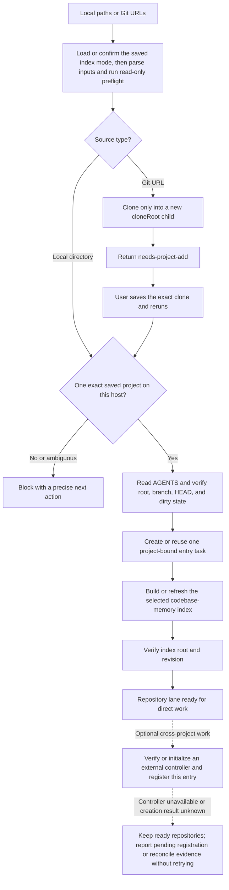
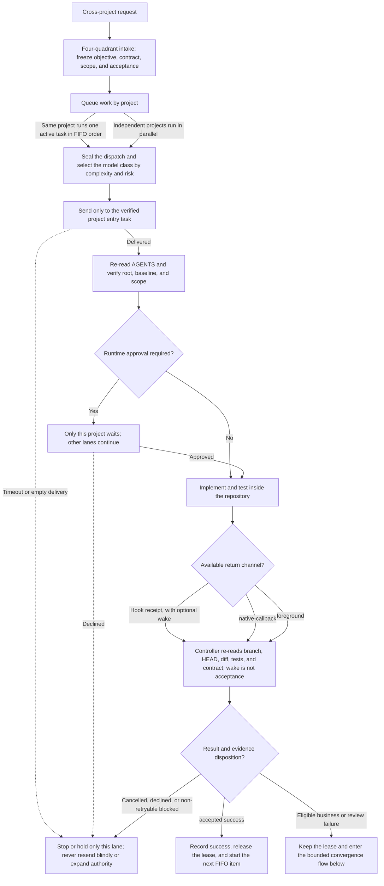
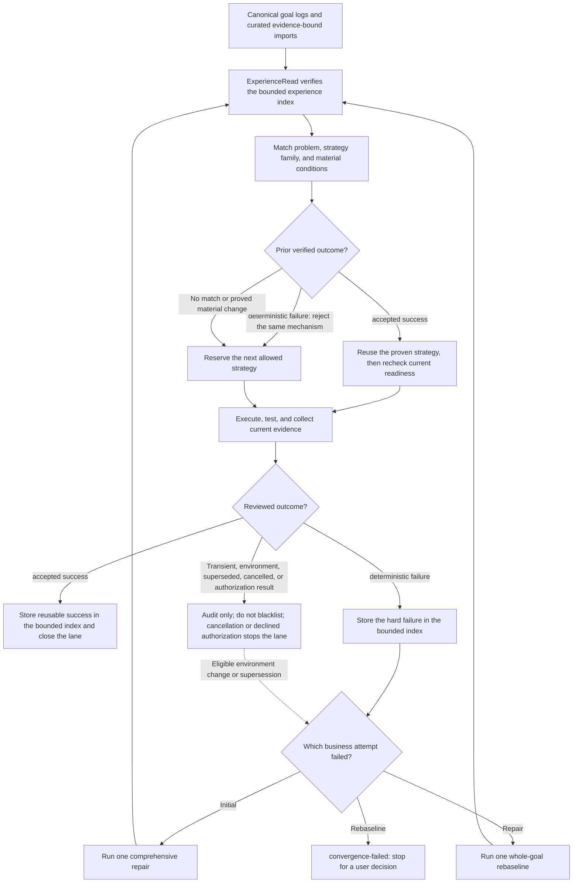
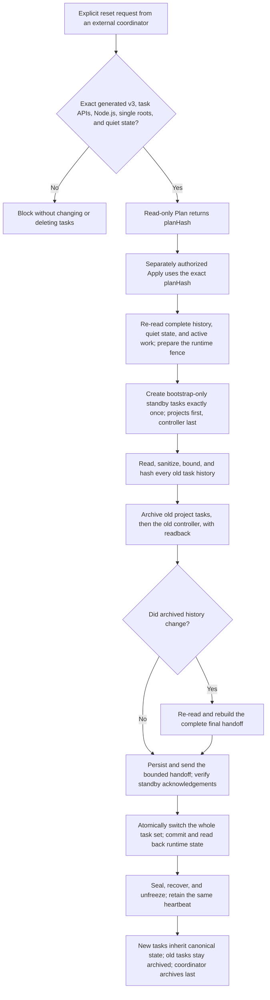

# onboard-code-projects

[English](./README.md) | [简体中文](./README.zh-CN.md)

[](https://github.com/libaie/onboard-code-projects/actions/workflows/windows-tests.yml)
[](./LICENSE)
[](#requirements-and-diagnostics)

Repository: [libaie/onboard-code-projects](https://github.com/libaie/onboard-code-projects)

`onboard-code-projects` is the Codex Desktop multi-repository workflow-isolation Skill that reduces context pollution with verified, reusable project tasks and `codebase-memory` indexes, plus an optional controller for cross-project coordination and evidence-backed reuse of accepted successes and deterministic failures.

- **Use when:** work crosses two or more related repositories.
- **You get:** exact-root, verified project-bound entry tasks, a `codebase-memory` index for each repository, and an optional controller for cross-project coordination.
- **It does not:** create saved Codex projects or approve permissions.
- **It is not:** a security sandbox, and it does not deploy software.

> **Preview:** Windows and Codex Desktop are the supported release surface. Other platforms are not yet release-tested end to end.

## Problems this Skill solves

| Pain point | What the Skill does |
| --- | --- |
| Context pollution | Keeps each exact project root, its instructions, evidence, and changes in a separate reusable task. |
| Repository and baseline drift | Verifies the saved project, root, branch, HEAD, working tree, and index before work starts. |
| Task proliferation | Reuses one project entry task for normal work and same-scope rework. |
| Lost completion signals | Supports foreground monitoring and, when the required plugin capabilities are available, durable result return. |
| Controller memory growth | Keeps long-running cross-project work bounded instead of loading one ever-growing task ledger. |

Use it when a feature, incident, or release crosses two or more repositories with different instructions, branch rules, tests, or write boundaries. For ordinary single-repository work, use that repository's project task directly.

### Choose the right boundary

| Option | Context and lifetime | Best use |
| --- | --- | --- |
| Single long conversation | Several repositories share one growing context. | A quick, low-risk check where repository rules do not differ. |
| Subagent | Short-lived parallel work inside the current task. | Independent subtasks that do not need a reusable project identity. |
| This Skill | One exact-root, reusable entry task per repository; the optional controller keeps only cross-project facts. | Features, incidents, and releases that cross repository boundaries. |

Project entry tasks may still use subagents internally; the two approaches are complementary.

## What you get

- For each source: one verified saved-project binding, one reusable local entry task, and one `codebase-memory` index.
- Optionally: one controller directory and controller task outside every business repository.
- Optionally: durable result return when the plugin Stop Hook and Node.js are available; automatic wake additionally requires validated rule, worker, and automation capabilities.

The Skill cannot create a saved Codex project. Add each exact directory in Codex Desktop first; the Skill verifies and uses that identity.

## Core workflows

The four flows below cover the public lifecycle. Exact payloads, hashes, reason codes, and recovery commands remain in the [controller runtime reference](./references/controller-runtime.md).

### 1. Onboard or reuse each repository



Saved projects stay user-owned. The Skill creates neither projectless tasks nor worktrees, and the optional controller must remain outside every business repository.

### 2. Coordinate, dispatch, and accept cross-project work



The controller writes governance state only. Repository edits and tests remain in the exact project entry task; a callback or receipt only signals that evidence is ready to inspect.

### 3. Reuse evidence-backed experience and stop retry loops



This is evidence reuse, not automatic learning. A changed material condition needs direct canonical evidence; renaming a task, opening a new conversation, or changing an unproved hash cannot erase a known deterministic failure. Only a zero-repository-write transport, tool-bootstrap, or payload-parse failure may receive one same-attempt preflight replay.

### 4. Refresh a long-lived controller task set



Apply is forward-only. An interruption keeps the set frozen and resumes the same operation; it never rolls back, deletes tasks, mutates canonical work records, or retries a task creation whose result is unknown.

## Quick start

### 1. Install

Send this in Codex:

```text
Use $skill-installer to install from https://github.com/libaie/onboard-code-projects with `--repo libaie/onboard-code-projects --path . --name onboard-code-projects`. Report the installed SKILL.md path and do not modify any project repository.
```

Restart Codex Desktop if the Skill is not discovered. Invoke it explicitly as `$onboard-code-projects`.

### 2. Save each project root

Add every repository's exact absolute root as a separate Codex project. Do not save one parent directory containing several repositories as a single project.

### 3. Onboard local projects

```text
Use $onboard-code-projects.

sources:
- source: C:\work\service-a
- source: C:\work\web-app
indexMode: full

Create or reuse one persistent local entry task per exact saved project, then build full codebase-memory indexes. Do not create worktrees or projectless tasks.
```

On first use, confirm the default index mode: `fast`, `moderate`, or `full`. `full` is recommended and the saved default can still be overridden per run.

### 4. Add a controller only for cross-project work

Create an empty directory outside all business repositories and save it as a Codex project. Then run:

```text
Use $onboard-code-projects.

sources:
- source: C:\work\service-a
- source: C:\work\web-app

controllerRoot: C:\work\multi-project-control
controllerName: Multi-Project Control Center
initializeController: true
createControllerTask: true
dispatchReturnMode: foreground

Initialize the controller and register the project entry tasks.
```

Without the plugin Stop Hook, use `native-callback` when available; otherwise use `foreground`. Install the plugin through a trusted source before selecting `receipts` or `receipts-and-wake`.

After setup, send cross-project work to the controller in ordinary language:

```text
Trace the invitation login flow across the H5 client, commerce backend, and member service. Start read-only, freeze the shared interface contract, dispatch repository-specific checks to the existing project tasks, and report end-to-end evidence.
```

### Refresh long-lived controller tasks

When a controller and its project entry tasks need fresh conversations, exact generated v3 support can replace the current bound set while carrying forward verified history. Start this from a separate coordinator task outside the set being replaced; it is archived last. The reset blocks safely when work is not quiet, complete history cannot be read, or the controller is custom, legacy, store-backed v2, or otherwise not an exact generated v3 installation.

```text
resetControllerTasks: true
Action: Plan
# Review the returned planHash, then send the same request with:
Action: Apply
planHash: <returned planHash>
```

Plan does not write and authorizes only the stable replacement scope; changing task history while reviewing the Plan does not require another approval. Apply accepts only the exact returned hash, creates bootstrap-only standby replacements with a unique creation marker and no business handoff, rechecks and freezes the complete old history, sends the final bounded sanitized handoff, and only then activates the new set. It deletes no task and resumes the same operation after interruption. See the [controller runtime reference](./references/controller-runtime.md) for advanced behavior and recovery.

Reset also requires usable Codex task APIs and an exact single-root saved project for every replacement; ambiguous roots or an unprovable task cwd block safely.

## Git URL onboarding

Git sources use a closed per-source object:

```text
Use $onboard-code-projects.

sources:
- source: https://github.com/example/service-a.git
  cloneRoot: C:\work\repos
  ref: main
  fullLfsCheckout: false
indexMode: full
```

The Skill clones only into a new child of `cloneRoot` and then returns `needs-project-add`. Save the exact clone as a Codex project and rerun the same request. The existing clone is reused only after its root, credential-free origin, and requested branch or ref are verified.

## Boundaries

This is **workflow isolation**, not a security sandbox. It does not change filesystem permissions, and manually mixing repositories in one task can reintroduce context pollution.

## Inputs

| Field | Required | Meaning |
| --- | --- | --- |
| `sources` | Yes | One or more local absolute directories or credential-free Git URL objects. |
| `sources[].source` | Yes | Local absolute directory or HTTPS/SSH Git URL. |
| `sources[].cloneRoot` | Git only | Existing absolute parent for a new clone child. |
| `sources[].branch` / `sources[].ref` | No | At most one requested Git identity per source. |
| `sources[].fullLfsCheckout` | No | Request full LFS content; default `false`. |
| `indexMode` | No | Per-run `fast`, `moderate`, or `full`. |
| `controllerRoot` | Controller only | A directory outside every business repository. |
| `controllerName` | No | Defaults to `Multi-Project Control Center`. |
| `initializeController` | No | Authorizes controller scaffold initialization. |
| `createControllerTask` | No | Authorizes controller task creation. |
| `resetControllerTasks` | No | Explicitly requests a safe Plan before replacing the current controller task set. |
| `dispatchReturnMode` | No | `foreground`, `native-callback`, `receipts`, or `receipts-and-wake`. |

Advanced upgrade and reconciliation inputs are documented in [the controller runtime reference](./references/controller-runtime.md).

## Requirements and diagnostics

| Component | When it is needed |
| --- | --- |
| Codex Desktop | Saved projects and project-bound tasks. |
| Windows PowerShell 5.1 | Supported execution environment. |
| [`codebase-memory`](https://github.com/DeusData/codebase-memory-mcp) | Required for every onboarding run: repository indexing and graph inspection. |
| Git | Git URLs and Git metadata. |
| OpenSSH | SSH Git URLs only. |
| Git LFS | Only when `fullLfsCheckout: true`. |
| Node.js 18+ | Controller task-set reset, durable Stop receipts, and automatic wake. |

These read-only preflight commands do not create projects, tasks, indexes, controller files, or Git state:

```powershell
# Local directory
powershell.exe -NoProfile -ExecutionPolicy Bypass -File .\scripts\preflight.ps1
# HTTPS Git URL
powershell.exe -NoProfile -ExecutionPolicy Bypass -File .\scripts\preflight.ps1 -RequireGit
# SSH Git URL
powershell.exe -NoProfile -ExecutionPolicy Bypass -File .\scripts\preflight.ps1 -RequireGit -RequireSsh
# Add -RequireLfs to the applicable Git command only for a full LFS checkout.
# Controller task-set reset or durable event return
powershell.exe -NoProfile -ExecutionPolicy Bypass -File .\scripts\preflight.ps1 -RequireNode
```

Skill-only installation provides project isolation, indexing, an optional controller, and foreground monitoring. Controller task-set reset requires Node.js 18+. Durable receipts require the plugin Stop Hook and Node.js; automatic wake also requires the capabilities validated by the Skill.

## Permissions and local data

When explicitly requested, the Skill may save the index preference, clone into a new child, create project-bound tasks, refresh indexes, or initialize the optional controller. It does not create Codex saved projects, switch branches, commit, push, deploy, write databases, or run project builds merely because onboarding was requested.

Runtime OS or tool approval stays with the exact project call that requested it; the controller cannot approve it on the project's behalf. Other independent projects may continue.

Recommended native defaults for new tasks are:

```toml
approval_policy = "on-request"
sandbox_mode = "workspace-write"
approvals_reviewer = "auto_review"
```

The Skill never rewrites global configuration without explicit authorization. An existing task may keep a task-level permission-mode override; select the intended mode once in that task rather than recreating it. Auto-review does not widen the sandbox or eliminate high-risk and Computer Use confirmations.

The optional plugin stores matching dispatch paths and task identifiers locally. It does not store the full assistant response, and the bundled runtime makes no network request. Uninstalling the Skill or plugin does not remove prior local controller state. See [SECURITY.md](./SECURITY.md) for trust boundaries and vulnerability reporting.

## Troubleshooting

- `needs-project-add`: save the exact reported project root in Codex Desktop, then rerun the same request.
- `needs-controller-project-add`: save the exact controller directory as a Codex project.
- `controller-thread-unknown`: do not create another controller task; follow the returned `nextAction` after checking the existing tasks.
- `index-unavailable`: restore `codebase-memory` and verify the exact root, branch, and HEAD.
- Runtime approval: approve or reject it in the corresponding project task; the controller cannot substitute for that decision.
- `safeToRerun=false`: do not automatically retry; use the returned recovery action.

## Known limits

- Saving Codex projects remains a user action.
- Windows is the only platform covered by deterministic automated tests.
- Real Codex Desktop task behavior and MCP integration still require the documented release gate.
- Workflow isolation cannot enforce operating-system permissions or prevent manual context mixing.
- Durable automatic result return requires the plugin Hook and additional validated runtime capabilities.
- No interactive dashboard or deployment automation is included.

## Documentation

- [Controller runtime reference](./references/controller-runtime.md) — advanced behavior and recovery contracts.
- [Security policy](./SECURITY.md) — trust boundaries, local data, and vulnerability reporting.
- [Contributing guide](./CONTRIBUTING.md) — development and verification commands.
- [Release checklist](./docs/release-checklist.md) — maintainer release and rollback gates.
- [MIT License](./LICENSE)
