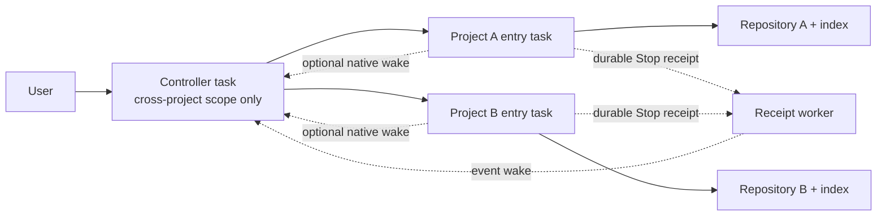

# onboard-code-projects

[English](./README.md) | [简体中文](./README.zh-CN.md)

[](https://github.com/libaie/onboard-code-projects/actions/workflows/windows-tests.yml)
[](./LICENSE)
[](#support-and-dependencies)

Repository: [libaie/onboard-code-projects](https://github.com/libaie/onboard-code-projects)

One business flow can span several repositories without forcing every repository into one polluted Codex conversation. This Skill gives every exact project root its own verified Codex task and `codebase-memory` index, while an optional generic controller coordinates cross-project contracts, dispatch, queues, result return, and end-to-end verification.

> **Preview:** Windows and Codex Desktop are the supported release surface. No tested app or MCP version is claimed until the real release gate records one.

## Problems this Skill solves

A business flow often spans a web app, mobile client, backend services, scheduled jobs, gateways, and deployment repositories. Handling all of them in one long Codex task looks convenient, but the conversation gradually mixes incompatible repository instructions, paths, branches, HEADs, tests, assumptions, and permissions.

| Pain point | What goes wrong without isolation | How the Skill responds |
| --- | --- | --- |
| Context pollution | Rules, evidence, or assumptions from one repository are reused in another. | Give every exact project root its own persistent task, instructions, Git facts, and index. |
| Repository and baseline drift | Work is performed against the wrong root, branch, HEAD, dirty tree, or stale index. | Bind and revalidate the exact saved project, host, normalized root, branch, HEAD, and task identity. |
| Task proliferation | Every scan, retry, or receipt poll creates another sidebar task, while completed reviews remain as clutter. | Reuse entry tasks for normal work and rework, keep one controller and one receipt worker, and archive each verified one-off review. |
| Lost completion signals | Project work finishes, but the controller cannot resume without a person saying “continue.” | Use durable Stop receipts only after Hook and Node capabilities are proved; add automatic wake only after the narrow rule, worker task, and heartbeat are also proved. |
| Controller memory growth | One append-only task ledger and one long conversation become slower and harder to trust. | Store each CHAIN separately, archive terminal work, and load only bounded startup memory plus the exact task needed. |
| Repair loops | A failed idea is renamed, moved to a successor task, or tried again after only HEAD changes, spending context without improving the result. | Bind attempts to one canonical goal lineage, reject repeated deterministic strategies, and reuse both success and failure experience. |
| Fragmented authorization | Business approval and operating-system prompts are confused or requested repeatedly in unrelated tasks. | Aggregate business decisions in the controller while keeping runtime approval attached to the exact project call that needs it. |

The central design rule is simple: **cross-project reasoning belongs in the controller; repository work belongs in that repository's entry task.**

### When it fits

Use it when a feature, incident, or release crosses two or more repositories and each repository has its own instructions, branch policy, tests, or write boundary. It is especially useful for long-lived Codex work where the same project tasks should be reused instead of recreated for every scan and repair.

Skip the controller for ordinary single-repository work. The project entry task already provides the isolation you need.

### How this differs from subagents

Subagents split work inside one active task. They are useful for short-lived parallel analysis, but they do not create durable saved-project identity or a reusable task history for each repository. `onboard-code-projects` keeps repository context in persistent project-bound tasks and lets the controller queue later work, validate returned evidence, and resume cross-project acceptance. The two approaches can be used together inside a project task.

## What it creates



- For every source: one exact saved Codex project binding, one reusable local entry task, and one verified `codebase-memory` index.
- Optionally: one controller directory and one controller task outside all business repositories.
- When durable return is capability-proven and selected: one receipt-worker task and one heartbeat attached only to that worker—not to the controller or project entries.
- For long-lived work: bounded controller memory, per-CHAIN event logs, canonical goal lineages, a bounded experience index, project queues, write leases, and immutable terminal archives.

The Skill cannot create a saved Codex project. You save each exact directory in Codex Desktop; the Skill verifies and uses that identity.

## Quick start

### 1. Install

Send this in Codex:

```text
Use $skill-installer to install from https://github.com/libaie/onboard-code-projects with `--repo libaie/onboard-code-projects --path . --name onboard-code-projects`. Report the installed SKILL.md path and do not modify any project repository.
```

Restart Codex Desktop if the Skill is not discovered. Invoke it explicitly as `$onboard-code-projects`.

### 2. Save the project roots

In Codex Desktop, add each repository's exact absolute root as a saved project. Do not create one parent project that contains several repositories.

### 3. Onboard the projects

```text
Use $onboard-code-projects.

sources:
- source: C:\work\service-a
- source: C:\work\web-app
indexMode: full

Create or reuse one persistent local entry task per exact saved project, then build full codebase-memory indexes. Do not create worktrees or projectless tasks.
```

On first use, the Skill asks you to confirm the default index mode. `full` is recommended; the choice is saved and can still be overridden per run.

### 4. Add a controller when work spans repositories

Create an empty directory outside every business repository and save that exact directory as a Codex project. Then run:

```text
Use $onboard-code-projects.

sources:
- source: C:\work\service-a
- source: C:\work\web-app

controllerRoot: C:\work\multi-project-control
controllerName: Multi-Project Control Center
initializeController: true
createControllerTask: true
dispatchReturnMode: foreground

Initialize the controller and register the project entry tasks.
```

This Skill-only quick start uses `foreground` because `$skill-installer` does not activate the plugin Stop Hook. Install the plugin first, then explicitly select `receipts-and-wake` when durable return and automatic wake are required.

After setup, give cross-project work to the controller in ordinary language. For example:

```text
Trace the invitation login flow across the H5 client, commerce backend, and member service. Start read-only, freeze the interface contract, dispatch repository-specific checks to their existing entry tasks, and report the end-to-end evidence and affected projects.
```

Single-project work can go directly to that project's entry task. Cross-project diagnosis, sequencing, contracts, and final acceptance belong in the controller.

## How isolation works

1. Resolve every source by exact host and normalized saved-project root; titles are display text, not identity.
2. Create or reuse one local, non-worktree entry task for that project and verify its task ID, root, branch, HEAD, and dirty state.
3. Build or refresh the `codebase-memory` index for that exact root and record its coverage boundary.
4. For cross-project work, freeze the objective, non-goals, acceptance evidence, permissions, baselines, shared contract, exact targets, required capabilities, rollback/verification, and return route in the controller before attempt one.
5. Dispatch one sealed repository-specific instruction to each existing entry task. The same project queues later work; independent projects can run concurrently.
6. Require each project to return its actual branch, HEAD, diff, tests, contract impact, and residual risk. The controller reads the real task and performs end-to-end acceptance.
7. When durable return is capability-proven and selected, the Stop Hook records one exact receipt and the isolated worker may wake the controller. Otherwise the Skill selects `native-callback`, then `foreground`. Every wake is untrusted; the controller reads the real project task before acceptance.

This is **workflow isolation**, not a security sandbox. It does not change filesystem permissions, and manually mixing repositories in one task can reintroduce contamination.

## Bounded convergence and reusable experience

Every repair belongs to one canonical goal lineage instead of a chain of renamed successor tasks. Each project lane gets at most three business strategies: `initial`, one whole-scope `repair`, and one `rebaseline`. One proved zero-repository preflight failure may replay the same dispatch once without replacing its goal reservation. Readiness gets one replan and one final failure proof; cross-project rebaseline reserves every affected lane atomically.

Before enqueue or retry, the controller binds the problem invariant, strategy family, material preconditions, acceptance and operation coverage, project reservation, and exact controller runtime. It reuses semantic IDs from prior experience; renaming or paraphrasing the same problem or mechanism does not reset the budget. A HEAD-only change or self-asserted hash cannot disguise the same deterministic failure. A materially changed contract, target, capability, runtime/toolchain, authorization boundary, failure oracle, or relevant source content may justify another strategy only with direct evidence.

Accepted successes and deterministic failures are written to `state/experience-index.json`. Curated older attempts can be imported through a separate CAS hash chain only when all eight material preconditions and the exact canonical CHAIN event/evidence/time are present; an import never fabricates a goal outcome or infers one from the whole CHAIN status. The controller refuses an identical failed strategy and can reuse a proven successful one, while cancellation, supersession, declined authorization, and transient failures do not blacklist a solution. Dependencies are explicit terminal predicates, and a dispatch closes only after its matching goal outcome is durable.

## Four-quadrant request intake

Before the controller classifies, freezes, or dispatches work, it uses one bounded intake pass:

| Quadrant | Behavior |
| --- | --- |
| Shared known | Confirm objective, context, acceptance, and boundaries; execute without asking again when complete. |
| User-known / agent-unknown | Ask at most three material questions in one round. Otherwise state assumptions and produce a reversible exploration version. |
| Agent-known / user-unknown | Add overlooked risks and alternatives; correct a false premise and recommend the better trade-off. |
| Shared unknown | Form a falsifiable hypothesis and, when needed, run an authorized one-variable experiment with success/failure signals and data to collect. |

The pass reuses the controller's existing objective, scope, acceptance, canonical task specification, and contract facts. It does not add authority or a second task-state schema.

## Support and dependencies

| Component | Status |
| --- | --- |
| Codex Desktop | Required with saved-project and project-bound task capabilities. Project creation still uses the app UI. |
| Windows + Windows PowerShell 5.1 | Supported by deterministic tests. |
| PowerShell 7, macOS, Linux | Not release-tested end to end. |
| [`codebase-memory` MCP](https://github.com/DeusData/codebase-memory-mcp) | Required: `index_repository`, `index_status`, and its own `list_projects`. |
| Git | Needed for Git URLs and Git metadata. |
| OpenSSH | Needed only for SSH URLs; known hosts and keys remain user-managed. |
| Git LFS | Needed only when `fullLfsCheckout: true`. |
| Node.js 18.0.0+ | Needed only for durable Stop receipts or the reusable receipt-worker heartbeat; preflight executes `node --version`. |

| Example input | Required local tools |
| --- | --- |
| Local directory | Codex Desktop project/task capabilities, `codebase-memory`, and PowerShell 5.1. |
| HTTPS Git URL | Local requirements plus Git. |
| SSH Git URL | HTTPS requirements plus OpenSSH, a known host, and a configured key. |
| Full LFS checkout | Matching Git transport requirements plus Git LFS. |
| Event return | Local requirements plus Node.js; `receipts-and-wake` also needs Codex automation support, the companion plugin Hook, and a working Codex `execpolicy check` rule validator. |

The Codex runtime must expose exact saved-project and task operations such as `list_projects`, `create_thread`, `read_thread`, `wait_threads`, `send_message_to_thread`, and `set_thread_archived`. The Skill inspects callable tools first and uses tool discovery only when available and necessary.

### Capability matrix

| Installation and proven capabilities | Available behavior |
| --- | --- |
| Skill only | Project isolation, indexing, optional controller, queues, bounded foreground monitoring, and native callback when the host exposes it. |
| Plugin with Stop Hook + Node.js | Durable `receipts`; completion is recorded even when no automatic wake is available. |
| Plugin + Hook + Node.js + validated narrow rule + receipt-worker task + heartbeat | `receipts-and-wake`; the worker may wake the controller, which still reads the real project task before acceptance. |

### Local data and Hook scope

The plugin Stop Hook is invoked for every Stop event, but writes only when the session, working directory, dispatch identity, generation, task hash, and terminal envelope exactly match a registered dispatch. On a match, the local runtime registry stores controller and project roots plus task identities. The controller receipt stores session and turn identities, the working directory, controller root, evidence hash, and terminal envelope. It does not store the full assistant response, and the bundled runtime makes no network request.

Uninstalling the Skill or plugin does not delete that local state. Worker-safe receipt calls use this fixed default registry and reject an explicit `--state-path`; a project cannot redirect them to another registry. Before manual cleanup, prove that no dispatch is registered and no receipt is pending; then remove `${CODEX_HOME}/skill-state/onboard-code-projects/runtime.json` and the applicable controller's `state/dispatch-receipts/` directory. Keep the controller's canonical CHAIN evidence.

The first run asks for an indexing default: `fast`, `moderate`, or `full`. `full` is recommended and never selected silently. The confirmed value is saved under `${CODEX_HOME}/skill-state/onboard-code-projects.json` (or the user profile `.codex` directory when `CODEX_HOME` is unset).

### Read-only diagnostics

These checks do not create projects, tasks, indexes, controller files, or Git state:

```powershell
# Local directory
powershell.exe -NoProfile -ExecutionPolicy Bypass -File .\scripts\preflight.ps1
# HTTPS Git URL
powershell.exe -NoProfile -ExecutionPolicy Bypass -File .\scripts\preflight.ps1 -RequireGit
# SSH Git URL
powershell.exe -NoProfile -ExecutionPolicy Bypass -File .\scripts\preflight.ps1 -RequireGit -RequireSsh
# Add -RequireLfs to the applicable Git command only for a full LFS checkout.
# Durable event return
powershell.exe -NoProfile -ExecutionPolicy Bypass -File .\scripts\preflight.ps1 -RequireNode
```

In Codex, ask it to inspect the currently exposed project/task capabilities and the `codebase-memory` operations listed above. This is capability discovery only; do not request task creation or indexing during diagnostics. There is no `diagnosticOnly` input. `-SelfTest` exercises bundled test fixtures and belongs only in **Verification**, not environment diagnostics.

## Installation

The primary installation journey uses the built-in `$skill-installer`. In Codex, send this natural-language request:

```text
Use $skill-installer to install from https://github.com/libaie/onboard-code-projects with `--repo libaie/onboard-code-projects --path . --name onboard-code-projects`. Report the installed SKILL.md path and do not modify any project repository.
```

Restart Codex Desktop if the Skill is not discovered. Invoke `$onboard-code-projects` explicitly; implicit invocation is disabled. A Skill-only install supports bounded foreground monitoring and the native callback. To use `receipts` or `receipts-and-wake`, install this repository as a Codex plugin through a trusted local or published marketplace so its Stop Hook is active, review the Hook once, and start a new task after installation.

If the installer cannot use the repository in the current environment, fall back to a source checkout and place it so the manifest is exactly:

```text
${CODEX_HOME}/skills/onboard-code-projects/SKILL.md
```

If `CODEX_HOME` is unset, use `<user-profile>/.codex/skills/onboard-code-projects/SKILL.md`.

An immutable Git tag is created only by a maintainer after the [release checklist](./docs/release-checklist.md) passes and separate publish/tag authorization is granted. This repository does not claim plugin or package publication.

Before publishing, run `powershell.exe -NoProfile -ExecutionPolicy Bypass -File .\scripts\preflight.ps1 -ReleaseGate`. It succeeds only from a clean exact repository root whose HEAD archive matches the public file allowlist. It also rejects private-path and credential shapes in the archive or reachable Git history. Ordinary tests do not imply release readiness.

## Copy-paste journeys

### 1. Onboard already saved projects only

On the first invocation, the Skill first asks you to confirm `fast`, `moderate`, or `full`; `full` is recommended and is never chosen silently.

```text
Use $onboard-code-projects.

sources:
- source: C:\work\service-a
- source: C:\work\web-app

Create persistent entry tasks in the exact saved projects, local and without worktrees, then build full codebase-memory indexes.
```

Expected safe boundary/result: tasks are created only in the two exact saved local projects; no controller or projectless task is created; the response remains the exact v1 per-project result array.

### 2. Onboard a Git URL for the first time

On the first invocation, the Skill first asks you to confirm `fast`, `moderate`, or `full`; `full` is recommended and is never chosen silently.

```text
Use $onboard-code-projects.

sources:
- source: https://github.com/example/service-a.git
  cloneRoot: C:\work\repos
  ref: main
  fullLfsCheckout: false
indexMode: full

Clone only into a new child of cloneRoot, then onboard it after I save the exact clone root as a Codex project.
```

Expected safe boundary/result: this is a clone-first flow. The Skill redacts and validates the URL before Git, never overwrites an existing child, disables submodules and LFS smudge, and returns `needs-project-add` after cloning. Save the exact clone as a Codex project, then rerun the same request; it reuses the verified clone only after exact root, credential-free origin, and requested ref checks, creates at most one local project task, and verifies the index.

### 3. Initialize a generic controller and entry tasks

On the first invocation, the Skill first asks you to confirm `fast`, `moderate`, or `full`; `full` is recommended and is never chosen silently.

First create an empty local directory outside every business repository. Then run:

```text
Use $onboard-code-projects.

sources:
- source: C:\work\service-a
- source: C:\work\web-app

controllerRoot: C:\work\multi-project-control
controllerName: Multi-Project Control Center
initializeController: true
createControllerTask: true
dispatchReturnMode: receipts-and-wake

Create persistent project entry tasks and initialize the generic controller.
```

Expected safe boundary/result: the Skill performs initializer `Plan -> Apply -> Verify`, creates only the documented bounded controller scaffold and memory store, and cannot save a Codex project. If the controller returns `needs-controller-project-add`, add that exact controller directory through the Codex Desktop project picker and rerun. Controller and repository tasks are always project-bound local tasks, never projectless or worktree tasks. The selected event mode separately authorizes the global dispatch registry, one dedicated project-bound local receipt-worker task, and one heartbeat attached only to that worker; neither the worker nor its heartbeat can accept project results.

### 4. Recover a missing project or unknown controller task

Recovery reuses the already saved index preference. If no preference exists, the normal first-run `fast`, `moderate`, or `full` confirmation still occurs; `full` remains recommended and is never chosen silently.

For `needs-project-add`, save the exact reported directory in Codex Desktop and rerun the original request.

For `controller-thread-unknown`, do not blindly rerun creation. The result supplies the exact current `operationId` and two copyable choices:

```text
sources:
- source: C:\work\service-a
- source: C:\work\web-app

controllerRoot: C:\work\multi-project-control
controllerReconciliation:
  action: bind
  operationId: <current-operation-id>
  threadId: <verified-real-thread-id>
```

or explicitly abandon the uncertain intent:

```text
sources:
- source: C:\work\service-a
- source: C:\work\web-app

controllerRoot: C:\work\multi-project-control
controllerReconciliation:
  action: abandon
  operationId: <current-operation-id>
  acknowledgeDuplicateRisk: true
```

Expected safe boundary/result: both recovery requests repeat the same complete sources. Local inputs use exact paths; a Git input must use only the credential-free/redacted replayable value returned by the failed run. Bind accepts only an authoritatively verified exact local controller task; abandon clears only the matching intent and never creates a replacement in the same run. Until either succeeds, `controller-thread-unknown` pairs with `controller-task-creation-pending` and `safeToRerun=false`.

For Git recovery, each returned bind and abandon action also repeats `cloneRoot`, the applicable `branch` or `ref`, and `fullLfsCheckout` (plus the current index mode and entry-task authorization description when present). Both actions contain identical replay-safe inputs and never echo credentials.

## Inputs

| Field | Required | Meaning |
| --- | --- | --- |
| `sources` | Yes | One or more closed source objects; unknown fields or conflicting duplicates fail the whole batch before Git. |
| `sources[].source` | Yes | Local absolute directory or credential-free HTTPS/SSH Git URL. |
| `sources[].cloneRoot` | Git only | Existing absolute parent for a new clone child. |
| `sources[].branch` / `sources[].ref` | No | At most one requested Git identity per source. |
| `indexMode` | No | Per-run `fast`, `moderate`, or `full`; does not rewrite the saved default. |
| `sources[].fullLfsCheckout` | No | Require full LFS content for that Git source; default `false`. |
| `controllerRoot` | For controller lane | Existing or prospective Windows local-drive root outside every project. |
| `controllerName` | No | Default `Multi-Project Control Center`. |
| `initializeController` | No | Allow the bounded controller and memory-store scaffold; default `false`. |
| `upgradeController` | No | Allow an exact known generated v1 or pre-store v2 controller to upgrade after a write-free Plan; default `false`. |
| `createControllerTask` | No | Allow exactly one durable-intent-protected task creation; default `false`. |
| `dispatchReturnMode` | No | `foreground`, `native-callback`, `receipts`, or `receipts-and-wake`. When omitted, select `receipts-and-wake` only after proving its Hook, Node, rule, worker, and heartbeat capabilities; otherwise fall back to `native-callback`, then `foreground`. |
| `controllerReconciliation` | Recovery only | Closed `bind`, `abandon`, `clear-stale-controller`, or `replace-project-binding` object with exact current identity evidence. |

Any controller input opts into a v2 `{controller, projects}` result. Controller root alone authorizes verified adapter registration, not scaffolding, upgrade, or task creation. An exact known generated v1 or pre-store v2 controller reports `controller-upgrade-authorization-required`; `upgradeController=true` runs a write-free Plan before a rollback-protected Apply that preserves bindings, existing queues, and human contracts. Differing managed bytes are never overwritten. A separate legacy trusted controller remains governed by its own explicit adapter contract and is never auto-migrated.

## Long-lived controller memory

The controller does not use one append-only Markdown file as both database and startup prompt. It separates state into:

- `.codex-controller.json`: controller identity, project bindings, dispatch queues, and leases;
- `state/active/*.jsonl`: one hash-chained event log per active CHAIN;
- `state/archive/YYYY-MM/*.jsonl`: immutable terminal CHAIN logs;
- `state/goals/*.jsonl`: canonical objective, per-project reservations, bounded strategy history, and terminal outcomes;
- `state/experience-index.json`: rebuildable bounded success and deterministic-failure experience;
- `state/dispatch-receipts/`: ignored transport receipts, claims, and acknowledgements; never canonical task state;
- `state/index.json`, `memory/MEMORY.md`, and `TASKS.md`: rebuildable bounded views, never authoritative.

At startup, the controller policy is already in force: it reads only `memory/MEMORY.md`, then runs `tools/chain-store.ps1 -Action Read`. It uses `tools/chain-store.ps1 -Action Get -ChainId <id>` for the exact CHAIN, then loads its project binding/queue and contract entry only when a concrete action needs them. The startup memory is capped at 200 lines and 25 KiB; the compact index keeps all active CHAINs, at most 500 recent terminal summaries by default, and exact total counts. Older tasks remain directly addressable from their monthly archive without entering every session's context.

CHAIN changes use `Put` with an exact head-entry hash (`MISSING` only for creation); terminal transitions require `-ConfirmTerminal`. `Verify` checks canonical and derived state, while `Rebuild` is reserved for a proven derived mismatch or interrupted canonical write. Direct edits to JSONL, the index, memory file, or dashboard are invalid. An abandoned active CHAIN is never hidden to shrink context: after direct proof that it has no active dispatch, pending queue item, or write lease, an explicit user decision terminalizes and archives it. Explicitly authorized legacy migration is shadow-first, verifies source hashes and semantic rules, preserves exact legacy bytes, and cuts over only while the controller is idle.

After 90 days on one controller task or 500 additional terminal CHAINs, the controller may recommend a new task epoch, but this version returns `controller-epoch-rotation-unsupported`. The current adapters do not provide one atomic expected-old binding replacement across controller state and the return registry. It never clears the old binding, invokes runtime replacement alone, creates a replacement task, or archives the old task. A future supported rotation will still require explicit authorization and a fully quiescent controller.

## Permissions and side effects

When explicitly requested, the Skill may save the index preference, clone into a new child, create one project-bound entry task, refresh an index, create the bounded controller/memory scaffold, create one controller task after durable intent, update verified controller state through the generated adapters, register exact active dispatches in the local global runtime registry, or create one durable project-bound receipt-worker task and attach one heartbeat to it after replay-safe intent persistence.

During onboarding and controller initialization, it does not create Codex saved projects, initialize controller Git, switch branches, commit, push, publish, deploy, write a database, run repository hooks/builds/submodules, or log secret-bearing URLs. A later project task may run tests or builds only when its own instructions and user authorization allow them. Existing managed files are replaced only by the separately authorized exact v1→v2 controller upgrade; unknown edits remain untouched. Controller initialization, upgrade, and controller task creation have separate Boolean authorizations.

Runtime OS or tool approval cannot be transferred to the controller. It stays on the exact project call that requested it. A cancellation request remains pending until that exact call ends; the controller never reports a waiting approval as stopped. Other independent projects may continue.

For new tasks, the recommended lower-friction safe native posture is:

```toml
approval_policy = "on-request"
sandbox_mode = "workspace-write"
approvals_reviewer = "auto_review"
```

The Skill inspects this posture but never rewrites global configuration without explicit authorization. Managed requirements and task, app, or tool overrides still win. Auto-review does not expand the sandbox or move approval to the controller. An existing task or existing chat can retain a task-level permission-mode override; select the recommended mode once in that task, then reload or restart the app as needed after changing global configuration. Never recreate the entry task to evade an override. For a proven recurring low-risk boundary, approve only one narrow `sandbox_workspace_write.writable_roots` entry or precise prefix rule for the observed path or command; never use `danger-full-access`, `approval_policy="never"`, or a broad interpreter/network command rule to reduce prompts. Manual confirmation still applies where native review is unavailable or ineligible, for high-risk actions, and for Computer Use prompts. A denied review stops and is not retried through an equivalent call. While one approval is unresolved, the controller waits on the original call and sends no follow-up, retry, or replacement invocation to that project.

Normal work and same-scope rework reuse the verified entry task. A feature should freeze design and cross-project contracts before dispatch; a well-evidenced fix can be dispatched directly. High-risk authorization boundaries do not change.

Generated v2 controllers persist one bounded FIFO per project. Before enqueue, read-only discovery freezes exact targets, operation class, capability references, rollback, verification, and the exact controller return route; credential-file locators are rejected. This readiness step is outside the implementation-attempt budget but has its own one-replan limit. The goal store reserves the exact project strategy before the adapter accepts enqueue or retry. The adapter injects the full dispatch identity into the canonical task specification, pins the exact controller runtime, hashes it, and `ExportDispatch` emits one closed single-line JSON message—no Base64 parser prompt. A retry reseals the identity, so generations cannot share a hash. An uncertain send is never replayed unless authoritative task evidence proves non-delivery and the target is idle. A blocked `transport`, `tool-bootstrap`, or `payload-parse` preflight may reopen the same attempt only after branch, HEAD, and dirty-state readback prove zero repository changes. One initial attempt, one whole-batch repair, and one architecture rebaseline share the business three-attempt limit; acceptance and review failures consume it. Further automatic repair stops as `CONVERGENCE_FAILED`, and the write lease stays held. A busy project queues later work while other projects continue concurrently. Runtime upgrades are refused until all queues are quiescent.

The controller records `economy`, `balanced`, or `frontier` from evidence and risk, then resolves an available concrete model. Rework keeps or raises that class only when new evidence crosses a boundary; waiting alone never escalates it. Controller history stores no credentials, only opaque project-scoped authorization references.

Progress commentary appears only when a state changes, at these fixed boundaries: `preflight`; `mapped N/M`; `task verified`; `index running`; `index ready`; `controller pending`; `controller ready`. Foreground monitoring remains bounded: after at most ten one-minute snapshots, active work returns `monitoring-paused` without changing its manifest state or lease. In a selected receipt mode, the dispatch is registered before delivery and the Stop Hook stores an exact durable receipt under `state/dispatch-receipts/`; a selected native-callback route may send one independent best-effort wake. The reusable `receipts-and-wake` worker heartbeat is attached only to its dedicated task, never the controller or a project entry, and is active only while registered dispatches remain. Worker and automation intents are persisted and read back before creation, so an unknown result is not retried. A wake or receipt never accepts success: the controller still reads and validates the project task. Do not make the shared registry a global `writable_roots` entry: use one reviewed Codex rule limited to `node`, the exact installed runtime, and its allowed subcommands, then restart Codex. See the official [Rules](https://learn.chatgpt.com/docs/agent-configuration/rules), [Hooks](https://learn.chatgpt.com/docs/hooks), and [Scheduled tasks](https://learn.chatgpt.com/docs/automations) documentation for those permission boundaries.

## Results and recovery

Without controller input, v1 returns one record per project. With controller input, v2 returns `{schemaVersion:2, controller, projects}`. Controller failure never downgrades an otherwise ready project; that project remains ready with pending controller registration.

| Controller state / reason | Recovery |
| --- | --- |
| `controller-ready` | Controller task and relevant bindings are verified. |
| `controller-initialized` | The scaffold is verified and the saved project is already resolved; rerun with `createControllerTask=true` only if a controller task is wanted. |
| `needs-controller-project-add` / `controller-project-not-saved` | Add the exact controller directory in Codex Desktop. |
| `controller-thread-unknown` / `controller-task-creation-pending` | Do not create again. Use the returned bind or abandon reconciliation. |
| `controller-upgrade-authorization-required` | Review the Plan, then rerun with `upgradeController=true` only if the exact generated v1 or pre-store v2 upgrade is approved. |
| `controller-conflict` | Resolve ambiguous/stale binding, overlap, candidate, or filesystem evidence without overwriting. |
| `blocked` | Correct authorization, invalid input, missing capability, or I/O failure. |

Every v2 recovery result includes `state`, `reasonCode`, `nextAction`, and `safeToRerun`. `safeToRerun=false` means an automatic rerun could duplicate a task or repeat an unauthorized write.

V1 project states include `registered`, `ready`, `needs-clone-root`, `needs-project-add`, `thread-creation-unknown`, `index-unavailable`, `registration-conflict`, and `blocked`. V1 project records use `blockReason` for other failure detail and do not add `reasonCode`. V2 project records retain those fields and use only `registrationReasonCode` for pending controller registration; the v2 controller object separately uses `reasonCode`. A `clientThreadId` or title is diagnostic/display data, never task identity.

## Verification

Run from the repository root:

```powershell
powershell.exe -NoProfile -ExecutionPolicy Bypass -File .\scripts\preflight.ps1 -SelfTest
powershell.exe -NoProfile -ExecutionPolicy Bypass -File .\scripts\preflight.tests.ps1
powershell.exe -NoProfile -ExecutionPolicy Bypass -File .\scripts\index-mode.tests.ps1
powershell.exe -NoProfile -ExecutionPolicy Bypass -File .\scripts\source-input.tests.ps1
powershell.exe -NoProfile -ExecutionPolicy Bypass -File .\scripts\chain-store.tests.ps1
node --test .\scripts\dispatch-return-runtime.tests.mjs
powershell.exe -NoProfile -ExecutionPolicy Bypass -File .\scripts\init-controller.tests.ps1
powershell.exe -NoProfile -ExecutionPolicy Bypass -File .\scripts\control-state.tests.ps1
powershell.exe -NoProfile -ExecutionPolicy Bypass -File .\scripts\skill-size.tests.ps1
powershell.exe -NoProfile -ExecutionPolicy Bypass -File .\scripts\skill-contract.tests.ps1
powershell.exe -NoProfile -ExecutionPolicy Bypass -File .\scripts\preflight.ps1 -ReleaseGate
```

These deterministic tests do not replace the disposable real Codex Desktop gate. See the [release checklist](./docs/release-checklist.md).

## Troubleshooting and rollback

- `needs-project-add`: add the exact project root in Codex Desktop; do not create an empty projectless task.
- `needs-controller-project-add`: add the exact initialized controller root as a saved project.
- `controller-thread-unknown`: inspect tasks, then use exact bind or acknowledged abandon; immediate rerun must not create again.
- `controller-binding-stale`: after authoritative evidence proves the current thread binding stale, use the returned `clear-stale-controller` action; it clears only that exact thread and creates nothing in the same run.
- `project-binding-conflict`: use the returned `replace-project-binding` action only after it names the exact stale identity and an authoritatively verified replacement; the CAS operation is idempotent and rejects concurrent identity drift.
- `controller-candidate-orphaned`: inspect the exact candidate and hash, then use the adapter's confirmed removal path.
- `index-unavailable`: reconnect `codebase-memory` and verify exact root, branch, and HEAD.
- Runtime approval: approve or reject it in the corresponding project task; controller approval cannot substitute.

Rollback means stop dispatch, preserve the manifest and evidence, and use only the adapter's confirmed matching-intent or candidate cleanup. Removing the installed Skill does not delete repositories, tasks, indexes, or prior controller state. Full release rollback is documented in the [release checklist](./docs/release-checklist.md).

## Known limits

- Codex saved-project creation remains a user action.
- Windows is the only platform covered by deterministic automated tests; release testing still requires the disposable Codex Desktop gate.
- Real Codex Desktop task behavior and MCP integration require the disposable manual gate.
- Workflow isolation cannot enforce operating-system permissions or stop manual context mixing.
- A Skill-only installation can use the native callback, but that single wake is best-effort transport. Durable `receipts-and-wake` is selected only after the companion Hook and worker capabilities are proved; its heartbeat is at-least-once transport, while controller validation and canonical CAS make processing idempotent.
- No interactive dashboard, controller-bound recurring heartbeat, or deployment automation is included. `TASKS.md` is a generated local view; migration is limited to exact recognized controller upgrades and explicitly authorized shadow migration.

See [CONTRIBUTING.md](./CONTRIBUTING.md), [SECURITY.md](./SECURITY.md), the [release checklist](./docs/release-checklist.md), and the [MIT License](./LICENSE).
