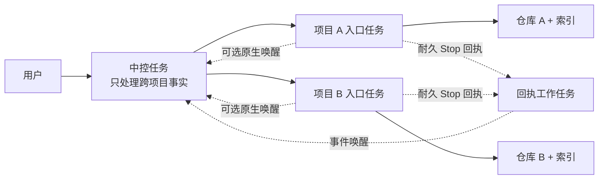

# onboard-code-projects

[English](./README.md) | [简体中文](./README.zh-CN.md)

[](https://github.com/libaie/onboard-code-projects/actions/workflows/windows-tests.yml)
[](./LICENSE)
[](#支持范围与依赖审查)

开源仓库：[libaie/onboard-code-projects](https://github.com/libaie/onboard-code-projects)

一条业务链路可以横跨多个仓库，但没必要把所有仓库塞进同一个不断膨胀的 Codex 会话。本 Skill 为每个精确项目根目录建立独立、可核验、可长期复用的 Codex 任务和 `codebase-memory` 索引；可选的通用中控负责跨项目契约、任务下发、排队、结果回传与全链路验收。

> **状态：预览版。** 当前发布面是 Windows 和 Codex Desktop。在真实发布门禁记录版本前，不声明已测试的 Codex 或 MCP 版本。

## 它解决什么痛点

一条真实业务链路往往同时涉及 Web、H5、小程序、后端服务、网关、定时任务和部署仓库。把这些项目全部塞进一个长期 Codex 会话看似方便，实际会逐渐混合各仓库的 `AGENTS.md`、路径、分支、HEAD、测试命令、未决假设与权限边界。

| 痛点 | 混在一个会话中的后果 | Skill 的处理方式 |
| --- | --- | --- |
| 上下文污染 | A 项目的规则、证据或假设被误用于 B 项目。 | 每个精确项目根拥有独立常驻任务、项目指令、Git 事实和索引。 |
| 仓库与基线漂移 | 在错误目录、分支、HEAD、脏工作区或过期索引上排查和修改。 | 绑定并反复核验保存项目、host、规范化根路径、分支、HEAD 与任务身份。 |
| 任务膨胀 | 每次扫描、重试或回执轮询都创建新任务，已完成复核也长期留在侧栏。 | 普通执行与返工复用入口任务；每个中控只保留一个中控任务和一个可选回执任务；一次性复核验收后立即归档。 |
| 完成状态丢失 | 项目任务已完成，中控却无法恢复，只能等待用户回复“继续”。 | Hook 与 Node 能力通过后才使用耐久 Stop 回执；窄规则、worker 任务和 heartbeat 也通过后，才启用自动唤醒。 |
| 中控记忆膨胀 | 单一 Markdown 台账和超长对话越来越慢，也难以确认哪份状态是真值。 | 每个 CHAIN 独立记录，终态按月归档，启动时只加载有界记忆和当前精确任务。 |
| 修复循环 | 同一种失败方案换个任务名、开后继 CHAIN，或只改 HEAD 后再次尝试，持续消耗上下文却没有提高成功率。 | 将尝试绑定到唯一目标谱系，拒绝重复的确定性失败策略，同时复用成功与失败经验。 |
| 授权入口分散 | 业务授权与操作系统运行时确认混在一起，用户需要在多个任务重复判断。 | 业务授权由中控聚合；系统或工具确认仍留在实际发起调用的项目任务中。 |

核心规则只有一句：**跨项目判断留在中控，仓库内执行留在该仓库的入口任务。**

### 适用场景

当一个功能、故障或发布涉及两个以上仓库，而且各仓库拥有不同的项目指令、分支规则、测试命令或写权限边界时，使用本 Skill。它也适合长期使用 Codex 的团队：项目入口可以反复复用，不必为每次扫描和返工继续新建任务。

普通单仓库工作不需要中控，直接使用该仓库的入口任务即可。

### 与 subagent 的区别

Subagent 用来拆分当前任务中的短期并行工作，但不会为每个仓库建立可长期复用的保存项目身份和任务历史。`onboard-code-projects` 把仓库上下文留在持久的项目绑定任务中，由中控负责排队、读取真实回传证据和跨项目验收。项目入口内部仍可以继续使用 subagent，两者并不冲突。

## 它会创建什么



- 每个 source：一个精确的已保存 Codex 项目绑定、一个可复用的本地入口任务、一个已核验的 `codebase-memory` 索引。
- 可选：位于所有业务仓库之外的一个中控目录和一个中控任务。
- 能力预检通过并选择耐久回传模式时：一个持久回执工作任务，以及只绑定该任务、不绑定中控或项目入口的 heartbeat。
- 长期治理：有界中控记忆、按 CHAIN 分片的事件日志、规范目标谱系、有界经验索引、项目队列、写租约和不可变终态归档。

Skill 不能创建 Codex 已保存项目。用户先在 Codex Desktop 保存每个精确目录，Skill 再核验并使用该身份。

## 快速开始

### 1. 安装

在 Codex 中发送：

```text
使用 $skill-installer 从 https://github.com/libaie/onboard-code-projects 安装，参数为 `--repo libaie/onboard-code-projects --path . --name onboard-code-projects`。报告安装后的 SKILL.md 路径，不要修改任何项目仓库。
```

如果 Codex 没有发现 Skill，请重启 Codex Desktop。使用时显式调用 `$onboard-code-projects`。

### 2. 保存项目目录

在 Codex Desktop 中，把每个仓库的精确绝对根目录分别添加为已保存项目。不要把包含多个仓库的父目录当成一个项目。

### 3. 接入项目

```text
使用 $onboard-code-projects。

sources:
- source: C:\work\service-a
- source: C:\work\web-app
indexMode: full

为每个精确的已保存项目创建或复用一个常驻本地入口任务，然后建立 full codebase-memory 索引。不要创建 worktree 或 projectless 任务。
```

首次使用时，Skill 会要求确认默认索引模式。推荐 `full`；该选择会持久化保存，单次调用仍可覆盖。

### 4. 跨项目工作再增加中控

先在所有业务仓库之外创建一个空目录，并把这个精确目录保存为 Codex 项目。然后运行：

```text
使用 $onboard-code-projects。

sources:
- source: C:\work\service-a
- source: C:\work\web-app

controllerRoot: C:\work\multi-project-control
controllerName: Multi-Project Control Center
initializeController: true
createControllerTask: true
dispatchReturnMode: foreground

初始化中控，并登记这些项目入口任务。
```

仅安装 Skill 的快速流程使用 `foreground`，因为 `$skill-installer` 不会启用插件 Stop Hook。需要耐久回传和自动唤醒时，先安装插件，再显式选择 `receipts-and-wake`。

初始化完成后，直接用自然语言把跨项目问题交给中控，例如：

```text
全链路排查 H5 推广海报登录流程，涉及 H5、商城后端和会员服务。先只读排查，冻结接口契约，再把各仓库检查下发到已有项目入口，最后回传端到端证据和涉及项目。
```

单项目工作可以直接交给对应项目入口；跨项目排查、依赖顺序、接口契约和最终验收交给中控。

## 隔离机制

1. 按精确 host 和规范化保存项目根解析 source；标题只用于展示，不能作为身份。
2. 为该项目创建或复用一个本地、非 worktree 入口任务，并核验任务 ID、路径、分支、HEAD 与脏工作区。
3. 为该精确根建立或刷新 `codebase-memory` 索引，并记录索引覆盖边界。
4. 跨项目任务由中控在第一次尝试前冻结目标、非目标、验收证据、权限、项目基线、共享契约、精确目标、所需能力、回滚/验证与回传路由。
5. 中控向每个已有入口任务发送一条密封的仓库级指令。同项目后续任务排队，不同项目可并行。
6. 项目任务回传真实分支、HEAD、diff、测试、契约影响与剩余风险；中控读取真实任务并进行全链路验收。
7. 能力预检通过并选择耐久回传时，Stop Hook 写入一条精确回执，由隔离 worker 按需唤醒中控；否则依次选择 `native-callback`、`foreground`。任何唤醒都不可信，中控仍须读取真实项目任务后验收。

这是**工作流隔离（workflow isolation）**，不是安全沙箱。它不改变文件系统权限；如果人为在一个任务中混合多个仓库，上下文污染仍会回来。

## 有界收敛与经验复用

每次修复都属于一个规范目标谱系，不能通过更名或新建后继任务重置预算。每个项目通道最多使用三种业务策略：`initial`、一次整批 `repair` 和一次 `rebaseline`。只有已证明仓库零变更的预检失败可以原派发重开一次，且不替换目标预留。就绪检查只允许一次重新规划和一次最终失败证明；跨项目重定基线必须一次性原子预留所有受影响项目通道。

入队或重试前，中控必须绑定问题不变量、策略族、实质前置条件、验收与操作覆盖、项目预留以及精确中控运行时，并复用历史经验中的稳定语义 ID；同一问题或机制换名、改写表述都不能重置预算。只改变 HEAD 或自行声称哈希变化不能伪装成新方案；只有契约、目标、能力、运行时/工具链、授权边界、失败判据或相关源码内容发生实质变化且有直接证据时，才可能允许下一策略。

已验收成功和确定性失败写入 `state/experience-index.json`。历史尝试只有在保留完整八项实质前置条件，并精确绑定规范 CHAIN 事件、证据哈希和观察时间时，才可通过独立 CAS 哈希链导入；导入不会伪造目标结果，也不会按整条 CHAIN 的终态推断单次策略结论。中控会拒绝重复的失败策略，也能复用已证明成功的方案；取消、被取代、用户拒绝授权和瞬态失败不会污染失败索引。依赖使用明确的终态谓词，派发只有在匹配的目标结果先持久化后才能关闭。

## 四象限请求协议

中控在任务分类、定义冻结或下发前，只做一次有界的请求判定：

| 象限 | 处理方式 |
| --- | --- |
| 共同已知（Shared known） | 核对目标、背景、验收和边界；信息完整时直接执行，不重复提问。 |
| 我的已知、你的未知（User-known / agent-unknown） | 只在答案会实质改变结果时一次提出最多三个（at most three）问题；否则明确合理假设（assumptions），并先产出可逆的探索版（exploration version）。 |
| 我的未知、你的已知（Agent-known / user-unknown） | 主动补充风险和替代路径；前提有误时直接纠正，并给出更优建议和取舍依据。 |
| 共同未知（Shared unknown） | 形成可证伪假设；必要时只改变一个变量，以成功/失败信号和待回收数据决定下一步。 |

协议复用中控既有的目标、范围、验收、规范化任务定义和契约事实，不增加授权，也不新增第二套任务状态结构。

## 支持范围与依赖审查

| 组件 | 当前状态 |
| --- | --- |
| Codex Desktop | 必需，且需提供已保存项目和项目绑定任务能力。项目创建仍通过应用界面完成。 |
| Windows + Windows PowerShell 5.1 | 已由确定性测试覆盖。 |
| PowerShell 7、macOS、Linux | 尚未完成发布级端到端验证。 |
| [`codebase-memory` MCP](https://github.com/DeusData/codebase-memory-mcp) | 必需：`index_repository`、`index_status` 和它自己的 `list_projects`。 |
| Git | Git URL 和 Git 元数据场景需要。 |
| OpenSSH | 仅 SSH URL 需要；主机指纹和密钥由用户在 Skill 外管理。 |
| Git LFS | 仅 `fullLfsCheckout: true` 时需要。 |
| Node.js 18.0.0+ | 仅持久化 Stop 回执或常驻回执工作任务的 heartbeat 需要；预检会实际执行 `node --version`。自动唤醒还要求 Codex 自动化能力、配套 Hook 和可用的 `execpolicy check` 规则校验器。 |

| 输入示例 | 需要的本地工具 |
| --- | --- |
| Local 本地目录 | Codex Desktop 项目/任务能力、`codebase-memory` 和 PowerShell 5.1。 |
| HTTPS Git URL | 本地目录要求加 Git。 |
| SSH Git URL | HTTPS 要求加 OpenSSH、已知主机和已配置密钥。 |
| 完整 LFS 检出 | 对应 Git 传输要求加 Git LFS。 |
| 事件回传 | 本地目录要求加 Node.js；`receipts-and-wake` 还需要 Codex 自动化能力、配套插件 Hook、一个常驻回执工作任务及其 heartbeat。 |

Codex 运行时需提供 `list_projects`、`create_thread`、`read_thread`、`wait_threads`、`send_message_to_thread`、`set_thread_archived` 等精确项目/任务能力。Skill 先检查已暴露工具，仅在可用且必要时进行工具发现。

### 能力矩阵

| 安装方式与已证明能力 | 可用行为 |
| --- | --- |
| 仅安装 Skill | 项目隔离、索引、可选中控、队列和有界前台监控；宿主提供能力时可用原生回调。 |
| Plugin 已启用 Stop Hook，且 Node.js 可用 | 可使用耐久 `receipts`；即使没有自动唤醒，也会记录完成回执。 |
| Plugin、Hook、Node.js、已校验窄规则、回执工作任务与 heartbeat 均可用 | 可使用 `receipts-and-wake`；worker 可以唤醒中控，但中控仍须读取真实项目任务后验收。 |

### 本地数据与 Hook 范围

插件的 Stop Hook 会收到每次 Stop 事件，但只有会话、工作目录、派发身份、代次、任务哈希和终态信封与已登记派发完全一致时才会写入。匹配后，本地运行时注册表会保存中控与项目根目录及任务标识；中控回执会保存会话和 turn 标识、工作目录、中控根目录、证据哈希与终态信封。它不会保存完整回复，随附运行时也不会发起网络请求。

卸载 Skill 或插件不会自动删除这些本地状态。worker 安全回执调用只能使用这个固定默认注册表，并拒绝显式 `--state-path`，项目任务不能把它重定向到其他注册表。手动清理前，先确认没有已登记派发和待处理回执；然后可删除 `${CODEX_HOME}/skill-state/onboard-code-projects/runtime.json` 及对应中控的 `state/dispatch-receipts/` 目录。中控的规范 CHAIN 证据应保留。

首次运行会要求确认默认索引模式：`fast`、`moderate` 或 `full`。推荐 `full`，但绝不静默代选。确认值保存在 `${CODEX_HOME}/skill-state/onboard-code-projects.json`；未设置 `CODEX_HOME` 时使用用户目录下的 `.codex`。

### Read-only 只读诊断

以下检查不会创建项目、任务、索引、中控文件或 Git 状态：

```powershell
# Local 本地目录
powershell.exe -NoProfile -ExecutionPolicy Bypass -File .\scripts\preflight.ps1
# HTTPS Git URL
powershell.exe -NoProfile -ExecutionPolicy Bypass -File .\scripts\preflight.ps1 -RequireGit
# SSH Git URL
powershell.exe -NoProfile -ExecutionPolicy Bypass -File .\scripts\preflight.ps1 -RequireGit -RequireSsh
# 仅完整 LFS 检出时，在适用 Git 命令后追加 -RequireLfs。
# 持久化事件回传
powershell.exe -NoProfile -ExecutionPolicy Bypass -File .\scripts\preflight.ps1 -RequireNode
```

在 Codex 中，可要求它只读检查上面列出的项目/任务能力及 `codebase-memory` 操作。诊断阶段不要请求任务创建或索引；不存在 `diagnosticOnly` 输入。`-SelfTest` 用于随附测试夹具，只属于后面的 **Verification 验证**，不能当作环境诊断。

## 安装

主安装流程使用内置 `$skill-installer`。在 Codex 中发送自然语言请求：

```text
使用 $skill-installer 从 https://github.com/libaie/onboard-code-projects 安装，参数为 `--repo libaie/onboard-code-projects --path . --name onboard-code-projects`。报告安装后的 SKILL.md 路径，不要修改任何项目仓库。
```

若未发现 Skill，请重启 Codex Desktop。隐式调用关闭，请显式使用 `$onboard-code-projects`。仅安装 Skill 时支持有界前台监控和原生回调；若要使用 `receipts` 或 `receipts-and-wake`，需通过可信本地或已发布 marketplace 把本仓库安装为 Codex 插件，启用其 Stop Hook，首次审阅 Hook 后新建任务使用。

如果当前环境的 installer 不能使用该仓库，再采用源码检出 fallback，并把仓库放到以下位置，使清单路径精确为：

```text
${CODEX_HOME}/skills/onboard-code-projects/SKILL.md
```

未设置 `CODEX_HOME` 时，使用 `<用户目录>/.codex/skills/onboard-code-projects/SKILL.md`。

不可变 Git 标签只能由维护者在[发布检查清单](./docs/release-checklist.md)通过且另行获得发布/打标签授权后创建。当前不声称已发布插件或安装包。

发布前运行 `powershell.exe -NoProfile -ExecutionPolicy Bypass -File .\scripts\preflight.ps1 -ReleaseGate`。只有精确仓库根目录工作区干净，且 HEAD 的 Git archive 与公开文件白名单完全一致时才通过；归档或可达 Git 历史中出现私有路径或凭据形状也会被拒绝。普通测试通过不代表可以发布。

## 四个可复制流程

### 1. 只接入已保存项目

首次调用时，Skill 会先要求确认 `fast`、`moderate` 或 `full`；推荐 `full`，且绝不会静默选择。

```text
使用 $onboard-code-projects。

sources:
- source: C:\work\service-a
- source: C:\work\web-app

在精确的已保存项目中创建常驻入口任务，使用本地环境且不创建 worktree，然后建立 full codebase-memory 索引。
```

预期安全边界/结果：任务只创建在两个精确的已保存本地项目中，不创建中控或 projectless 任务；没有任何 controller 输入时，返回格式保持为原有 v1 项目结果数组。

### 2. 首次接入 Git URL

首次调用时，Skill 会先要求确认 `fast`、`moderate` 或 `full`；推荐 `full`，且绝不会静默选择。

```text
使用 $onboard-code-projects。

sources:
- source: https://github.com/example/service-a.git
  cloneRoot: C:\work\repos
  ref: main
  fullLfsCheckout: false
indexMode: full

只克隆到 cloneRoot 的新子目录；我把精确克隆根保存为 Codex 项目后再完成接入。
```

预期安全边界/结果：这是 clone-first 流程。Skill 在 Git 操作前脱敏并校验 URL，不覆盖既有子目录，关闭 submodule 和 LFS smudge；克隆后先返回 `needs-project-add`。save 精确 clone 为 Codex 项目后，使用 same request 重跑；只有精确根、不含凭据的 origin 和请求 ref 均匹配时才复用 verified clone，随后最多创建一个本地项目任务并核验索引。

### 3. 初始化通用中控并创建项目入口

首次调用时，Skill 会先要求确认 `fast`、`moderate` 或 `full`；推荐 `full`，且绝不会静默选择。

先在所有业务仓库之外创建一个空目录，然后运行：

```text
使用 $onboard-code-projects。

sources:
- source: C:\work\service-a
- source: C:\work\web-app

controllerRoot: C:\work\multi-project-control
controllerName: Multi-Project Control Center
initializeController: true
createControllerTask: true
dispatchReturnMode: receipts-and-wake

创建项目入口任务并初始化通用中控。
```

预期安全边界/结果：Skill 执行初始化器 `Plan -> Apply -> Verify`，只创建文档约定的有界中控脚手架与记忆存储，不能替用户保存 Codex 项目。如果返回 `needs-controller-project-add`，请通过 Codex Desktop 项目选择器添加精确的中控目录后重跑。中控和仓库任务都必须绑定已保存项目和本地环境，不得使用无项目任务或 worktree。所选事件模式另外授权全局下发登记、一个独立且绑定项目的回执工作任务，以及只绑定该工作任务的 heartbeat；worker 和 heartbeat 都无权验收项目结果。

### 4. 恢复未保存项目或未知中控任务

恢复流程复用已保存的索引偏好；若偏好不存在，仍先确认 `fast`、`moderate` 或 `full`，推荐 `full`，且绝不会静默选择。

遇到 `needs-project-add` 时，在 Codex Desktop 中保存报告的精确目录，然后重跑原请求。

遇到 `controller-thread-unknown` 时，不要直接再次创建。结果会给出当前 `operationId` 和两个可复制选项。确认找到真实任务后绑定：

```text
sources:
- source: C:\work\service-a
- source: C:\work\web-app

controllerRoot: C:\work\multi-project-control
controllerReconciliation:
  action: bind
  operationId: <当前-operation-id>
  threadId: <已核验真实-thread-id>
```

或者明确放弃不确定意图：

```text
sources:
- source: C:\work\service-a
- source: C:\work\web-app

controllerRoot: C:\work\multi-project-control
controllerReconciliation:
  action: abandon
  operationId: <当前-operation-id>
  acknowledgeDuplicateRisk: true
```

预期安全边界/结果：两种恢复请求都重复同一组完整 sources。本地输入使用精确路径；Git 输入只能使用失败结果返回的不含凭据、已脱敏且可安全重放的值。bind 只接受经过权威核验的精确本地中控任务；abandon 只清除匹配意图，本次运行绝不会创建替代任务。在两者成功前，`controller-thread-unknown` 与 `controller-task-creation-pending` 配对，且 `safeToRerun=false`。

对于 Git recovery，返回的 bind 和 abandon action 都会重复 `cloneRoot`、适用的 `branch` 或 `ref`、`fullLfsCheckout`，并在存在时保留本次 index mode 与入口任务授权描述。两者携带完全相同的安全重放输入，绝不回显凭据。

## 输入

| 字段 | 是否必需 | 含义 |
| --- | --- | --- |
| `sources` | 是 | 一个或多个封闭 source 对象；未知字段或选项冲突的重复项会在 Git 前使整批失败。 |
| `sources[].source` | 是 | 本地绝对目录或不含凭据的 HTTPS/SSH Git URL。 |
| `sources[].cloneRoot` | 仅 Git | 新克隆子目录的既有绝对父目录。 |
| `sources[].branch` / `sources[].ref` | 否 | 每个 source 最多指定一种 Git 身份。 |
| `indexMode` | 否 | 本次 `fast`、`moderate` 或 `full`；不改已保存默认值。 |
| `sources[].fullLfsCheckout` | 否 | 是否为该 Git source 获取完整 LFS，默认 `false`。 |
| `controllerRoot` | 中控场景 | 位于所有项目外的 Windows 本地磁盘根目录。 |
| `controllerName` | 否 | 默认 `Multi-Project Control Center`。 |
| `initializeController` | 否 | 授权创建有界的中控与记忆存储脚手架，默认 `false`。 |
| `upgradeController` | 否 | 在只读 Plan 后授权升级精确已知的通用 v1 或尚无分片存储的 v2 中控，默认 `false`。 |
| `createControllerTask` | 否 | 授权在持久意图保护下创建一次中控任务，默认 `false`。 |
| `dispatchReturnMode` | 否 | `foreground`、`native-callback`、`receipts` 或 `receipts-and-wake`。省略时，只有 Hook、Node、规则、worker 与 heartbeat 能力均被证明后才选择 `receipts-and-wake`；否则依次降级为 `native-callback`、`foreground`。 |
| `controllerReconciliation` | 仅恢复 | 携带精确当前身份凭据的封闭 `bind`、`abandon`、`clear-stale-controller` 或 `replace-project-binding` 对象。 |

任一 controller 输入都会启用 v2 `{controller, projects}` 结果。只有 `controllerRoot` 仅授权登记，不授权脚手架、升级或任务创建。精确已知的通用 v1 或尚无分片存储的 v2 中控会返回 `controller-upgrade-authorization-required`；只有 `upgradeController=true` 才会先做只读 Plan，再执行可回滚 Apply，并保留绑定、既有队列与人工契约。托管文件有未知改动时绝不覆盖。独立的旧版可信中控仍按自身明确的适配器契约使用，不会自动迁移。

## 长期中控记忆

中控不再把一个持续追加的 Markdown 文件同时当数据库和启动上下文，而是分层保存：

- `.codex-controller.json`：中控身份、项目绑定、下发队列与租约；
- `state/active/*.jsonl`：每个活动 CHAIN 一份带哈希链的事件日志；
- `state/archive/YYYY-MM/*.jsonl`：终态 CHAIN 的不可变月度归档；
- `state/goals/*.jsonl`：规范目标、各项目预留、有界策略历史与终态结果；
- `state/experience-index.json`：可重建且有界的成功与确定性失败经验；
- `state/dispatch-receipts/`：被忽略的传输回执、认领和确认记录，不是任务真值；
- `state/index.json`、`memory/MEMORY.md` 与 `TASKS.md`：可重建的有界视图，不是真值源。

中控启动时策略已自动生效，只读取 `memory/MEMORY.md`，随后执行 `tools/chain-store.ps1 -Action Read`。具体动作需要时，先用 `tools/chain-store.ps1 -Action Get -ChainId <id>` 精确读取 CHAIN，再加载它所需的项目绑定/队列和契约条目。启动记忆最多 200 行、25 KiB；紧凑索引保留全部活动 CHAIN、默认最多 500 条最近终态摘要以及准确总数。更早的任务仍可从月度归档精确查询，但不会进入每次会话上下文。

CHAIN 变更必须通过 `Put` 并携带精确头事件哈希（仅新建使用 `MISSING`）；转入终态还需 `-ConfirmTerminal`。`Verify` 用于完整性校验，`Rebuild` 只处理已证明的派生视图不一致或中断写入。不得直接修改 JSONL、索引、启动记忆或任务看板。失去后续价值的活动 CHAIN 不能为了缩短上下文而直接隐藏；只有直接证据证明它没有活动派发、排队项或写租约，并取得用户明确终态决定后，才可归档。经明确授权的旧台账迁移先生成影子存储，核验源哈希与语义规则、保留原始字节，并且只在中控空闲时切换。

同一个中控任务运行满 90 天，或新增 500 个终态 CHAIN 后，中控可以建议开启新的任务 epoch，但当前版本固定返回 `controller-epoch-rotation-unsupported`。现有适配器尚未提供跨中控状态与回传注册表的原子 expected-old 绑定替换；不得通过清空旧绑定、单独调用运行时替换、创建替换任务或归档旧任务来模拟轮换。未来实现闭环后，仍须取得明确授权并证明中控完全静默。

## 权限与副作用

在明确授权时，Skill 可以保存索引偏好、在新子目录克隆、创建一个项目绑定入口任务、刷新索引、创建有界的中控/记忆脚手架、在持久意图后创建一次中控任务、通过生成的适配器更新已核验中控状态、在本机全局运行时登记精确活动下发，或创建一个独立且绑定项目的回执工作任务，并只为该工作任务绑定一个 heartbeat。

在项目接入和中控初始化阶段，它不会创建 Codex 已保存项目，不会初始化中控 Git，也不会切换分支、提交、推送、发布、部署、写数据库、运行仓库 hook/build/submodule 或输出含秘密的 URL。后续项目任务只有在项目规则和用户授权允许时，才能运行测试或构建。只有单独授权的精确 v1→v2 中控升级会替换已知托管文件；未知改动保持不动。中控初始化、升级和中控任务创建分别授权。

操作系统或工具弹出的运行时批准不能转移给中控，仍属于发起调用的精确项目任务。取消请求在该调用真正结束前只表示“取消待完成”，中控不会把仍在等待批准的调用误报为已停止；其他独立项目仍可继续。

对于新任务，推荐使用以下低打扰且保留安全边界的原生权限姿态：

```toml
approval_policy = "on-request"
sandbox_mode = "workspace-write"
approvals_reviewer = "auto_review"
```

Skill 会核对该姿态，但未经明确授权绝不改写全局配置；托管要求以及任务、应用或工具覆盖项仍优先。自动评审不会扩大沙箱，也不能把批准转移给中控。已有任务或已有会话可能保留会话级权限模式覆盖项，必须在该任务中一次选择推荐权限模式；全局配置变更后再按需重载或重启应用，不得重建入口任务规避覆盖。对于已证实会重复出现的低风险边界，只批准与实际路径或命令对应的一个窄 `sandbox_workspace_write.writable_roots` 条目或精确 prefix rule；不得用 `danger-full-access`、`approval_policy="never"` 或宽泛解释器/网络命令规则降低提示频次。原生评审不可用或不适用的操作、高风险操作及 Computer Use 提示仍需人工确认；自动评审拒绝时应停止，不得用等价调用重试。一个运行时批准未决期间，中控只等待原调用，不向该项目发送 follow-up、重试或替代调用。

正常工作和同范围返工复用已核验入口任务。新增功能应先冻结设计与跨项目契约；根因、范围和验收已确定的修复可以直接下发。高风险授权边界不变。

生成的 v2 中控会为每个项目持久化一个有界 FIFO。入队前先用只读发现冻结精确目标、操作类别、能力引用、回滚、验证和精确中控回传路由；禁止在控制状态中保存凭据文件定位路径。这一步位于实现尝试预算之外，但自身只有一次重新规划机会。目标存储先预留精确项目策略，适配器才接受入队或重试。适配器把完整派发身份注入规范任务定义、固定精确中控运行时并计算哈希，`ExportDispatch` 只输出一条封闭单行 JSON，不再下发 Base64 解析提示；返工会重新密封，因此不同代次不会共用哈希。投递不确定时绝不盲目重发。若 `transport`、`tool-bootstrap` 或 `payload-parse` 在仓库操作前失败，只有分支、HEAD 和工作区指纹仍与基线完全一致时，才允许原代次重开且不消耗业务次数。初次尝试、一次整批根因修复和一次架构重定基线共同使用业务三次总预算；中控验收或复核失败会消耗该预算。之后自动修复停止并返回 `CONVERGENCE_FAILED`，且保留写租约。同项目忙碌时后续任务排队，其他项目继续并行。所有队列静默前禁止升级中控运行时。

中控按证据和风险记录 `economy`、`balanced` 或 `frontier`，再解析当前可用具体模型；返工仅在新证据跨越等级边界时保持或升级等级，等待本身不会触发升级。中控历史不保存凭据，只保存项目范围内的不透明授权引用。

进度 commentary 只在状态变化时出现，固定边界是：`preflight`；`mapped N/M`；`task verified`；`index running`；`index ready`；`controller pending`；`controller ready`。前台监控仍有界：最多十次、每次一分钟的快照后，仍活动的任务返回 `monitoring-paused`，但不改变清单状态或租约。选择回执模式时会在投递前登记派发，并由 Stop Hook 把精确持久回执写入 `state/dispatch-receipts/`；选择 `native-callback` 时，项目可另发一次尽力而为的原生唤醒。可复用 `receipts-and-wake` worker heartbeat 只绑定独立 worker，且仅在仍有登记派发时启用，绝不绑定中控或项目入口。创建任务和自动化前先持久化并回读意图，结果不确定时不得重试。唤醒或回执都不代表成功，中控仍须读取并核验项目任务。不得把共享登记目录加入全局 `writable_roots`；应使用一条仅允许 `node + 已安装运行时精确路径 + 指定子命令` 的已审阅 Codex rule，并重启 Codex。相关权限边界见 OpenAI 官方 [Rules](https://learn.chatgpt.com/docs/agent-configuration/rules)、[Hooks](https://learn.chatgpt.com/docs/hooks) 与[定时任务](https://learn.chatgpt.com/docs/automations)文档。

## 结果与恢复

无 controller 输入时，v1 每个项目返回一条记录；有 controller 输入时，v2 返回 `{schemaVersion:2, controller, projects}`。中控失败不会让本来 ready 的项目失败，只会标记待中控登记。

| 中控状态 / 原因 | 恢复方式 |
| --- | --- |
| `controller-ready` | 中控任务和本次相关绑定均已核验。 |
| `controller-initialized` | 脚手架已核验且已解析到保存项目；只有确实需要中控任务时，才以 `createControllerTask=true` 重跑。 |
| `needs-controller-project-add` / `controller-project-not-saved` | 在 Codex Desktop 中添加精确中控目录。 |
| `controller-thread-unknown` / `controller-task-creation-pending` | 不得再次创建；使用返回的 bind 或 abandon。 |
| `controller-upgrade-authorization-required` | 先审阅 Plan；只在批准精确通用 v1 或尚无分片存储的 v2 升级后使用 `upgradeController=true`。 |
| `controller-conflict` | 在不覆盖的前提下解决歧义、陈旧绑定、重叠、候选或文件系统证据。 |
| `blocked` | 修正授权、输入、缺少的能力或 I/O 故障。 |

每个 v2 恢复结果都包含 `state`、`reasonCode`、`nextAction` 和 `safeToRerun`。`safeToRerun=false` 表示自动重跑可能重复创建任务或重复未授权写入。

V1 项目状态包括 `registered`、`ready`、`needs-clone-root`、`needs-project-add`、`thread-creation-unknown`、`index-unavailable`、`registration-conflict` 和 `blocked`。V1 项目记录使用 `blockReason` 表达其他失败细节，不添加 `reasonCode`。V2 项目记录保留这些字段，只在待中控登记时使用 `registrationReasonCode`；v2 controller 对象另有 `reasonCode`。`clientThreadId` 与标题只用于诊断或展示，不能作为任务身份。

## 验证

在仓库根目录运行：

```powershell
powershell.exe -NoProfile -ExecutionPolicy Bypass -File .\scripts\preflight.ps1 -SelfTest
powershell.exe -NoProfile -ExecutionPolicy Bypass -File .\scripts\preflight.tests.ps1
powershell.exe -NoProfile -ExecutionPolicy Bypass -File .\scripts\index-mode.tests.ps1
powershell.exe -NoProfile -ExecutionPolicy Bypass -File .\scripts\source-input.tests.ps1
powershell.exe -NoProfile -ExecutionPolicy Bypass -File .\scripts\chain-store.tests.ps1
node --test .\scripts\dispatch-return-runtime.tests.mjs
powershell.exe -NoProfile -ExecutionPolicy Bypass -File .\scripts\init-controller.tests.ps1
powershell.exe -NoProfile -ExecutionPolicy Bypass -File .\scripts\control-state.tests.ps1
powershell.exe -NoProfile -ExecutionPolicy Bypass -File .\scripts\skill-size.tests.ps1
powershell.exe -NoProfile -ExecutionPolicy Bypass -File .\scripts\skill-contract.tests.ps1
powershell.exe -NoProfile -ExecutionPolicy Bypass -File .\scripts\preflight.ps1 -ReleaseGate
```

这些确定性测试不能替代一次性真实 Codex Desktop 门禁，详见[发布检查清单](./docs/release-checklist.md)。

## 排障与回滚

- `needs-project-add`：在 Codex Desktop 添加精确项目根，不要创建无项目空任务。
- `needs-controller-project-add`：把已初始化的精确中控根保存为 Codex 项目。
- `controller-thread-unknown`：先检查任务，再用精确 bind 或已确认风险的 abandon；立即重跑不得再次创建。
- `controller-binding-stale`：权威证据证明当前线程绑定已陈旧后，使用返回的 `clear-stale-controller`；它只清除该精确线程，本次不会创建任务。
- `project-binding-conflict`：仅在返回动作同时给出精确旧身份和已权威核验的新身份时，使用 `replace-project-binding`；CAS 操作支持幂等重放并拒绝并发身份漂移。
- `controller-candidate-orphaned`：检查精确候选文件与哈希，再使用适配器的确认删除流程。
- `index-unavailable`：恢复 `codebase-memory`，核对精确根、分支和 HEAD。
- 运行时批准：在对应项目任务中允许或拒绝；中控不能替代批准。

回滚时停止下发，保留 manifest 与证据，只使用适配器对匹配意图或候选文件进行确认清理。删除 Skill 不会删除仓库、任务、索引或既有中控状态。完整发布回滚见[发布检查清单](./docs/release-checklist.md)。

## 已知限制

- Codex 已保存项目仍需用户操作。
- Windows 是唯一由确定性自动化测试覆盖的平台；完成发布测试仍需通过一次性 Codex Desktop 门禁。
- 真实 Codex Desktop 任务行为和 MCP 集成需要一次性手工门禁。
- 工作流隔离不能强制操作系统权限，也不能阻止人为混合上下文。
- 仅安装 Skill 时可以使用原生回调，但这条唤醒属于尽力传输。只有配套 Hook 与 worker 能力均被证明时才选择 `receipts-and-wake`；worker heartbeat 是至少一次传输，中控证据核验和规范状态 CAS 保证幂等处理。
- 不含交互式 dashboard、中控任务内循环 heartbeat 或部署自动化。`TASKS.md` 只是本地生成视图；迁移仅限精确识别的中控升级和经明确授权的影子迁移。

参见[贡献指南](./CONTRIBUTING.md)、[安全策略](./SECURITY.md)、[发布检查清单](./docs/release-checklist.md)和 [MIT 许可证](./LICENSE)。
