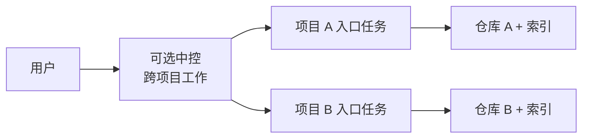

# onboard-code-projects

[English](./README.md) | [简体中文](./README.zh-CN.md)

[](https://github.com/libaie/onboard-code-projects/actions/workflows/windows-tests.yml)
[](./LICENSE)
[](#环境要求与只读诊断)

开源仓库：[libaie/onboard-code-projects](https://github.com/libaie/onboard-code-projects)

让每个仓库使用独立、可核验的 Codex 项目任务，避免在一个长期会话中混合多个代码库、项目指令、分支和权限。需要跨仓库协同时，可选中控负责统一排查与验收。

> **状态：预览版。** 当前支持的发布面是 Windows 和 Codex Desktop，其他平台尚未完成发布级端到端验证。

## 它解决什么痛点

| 痛点 | Skill 的处理方式 |
| --- | --- |
| 上下文污染 | 每个精确项目根目录、项目指令、证据和修改都留在独立且可复用的任务中。 |
| 仓库与基线漂移 | 执行前核验已保存项目、根目录、分支、HEAD、工作区和索引。 |
| 任务膨胀 | 普通工作与同范围返工复用同一个项目入口任务。 |
| 完成状态丢失 | 支持前台监控；插件能力满足时，还可使用耐久结果回传。 |
| 中控记忆膨胀 | 对长期跨项目工作使用有界记忆，不把不断增长的任务台账全部加载进会话。 |

适用于一个功能、故障或发布涉及两个以上仓库，并且各仓库有不同项目指令、分支规则、测试命令或写权限边界的场景。普通单仓库工作直接使用该仓库的项目任务即可。

### 与 subagent 的区别

Subagent 用于拆分当前任务中的短期工作；本 Skill 创建可跨后续任务复用的项目绑定入口。项目任务内部仍可继续使用 subagent，两者可以配合使用。

## 它会创建什么



- 每个 source：一个已核验的保存项目绑定、一个可复用的本地入口任务和一个 `codebase-memory` 索引。
- 可选：位于所有业务仓库之外的一个中控目录和中控任务。
- 可选：耐久结果回传需要插件 Stop Hook 与 Node.js；自动唤醒还需要额外的规则、worker 和自动化能力。

Skill 不能创建 Codex 已保存项目。用户需先在 Codex Desktop 中添加每个精确目录，Skill 再核验并使用该身份。

## 快速开始

### 1. 安装

在 Codex 中发送：

```text
使用 $skill-installer 从 https://github.com/libaie/onboard-code-projects 安装，参数为 `--repo libaie/onboard-code-projects --path . --name onboard-code-projects`。报告安装后的 SKILL.md 路径，不要修改任何项目仓库。
```

如果 Codex 没有发现 Skill，请重启 Codex Desktop。使用时显式调用 `$onboard-code-projects`。

### 2. 分别保存项目根目录

把每个仓库的精确绝对根目录分别添加为 Codex 项目。不要把包含多个仓库的父目录保存为一个项目。

### 3. 接入本地项目

```text
使用 $onboard-code-projects。

sources:
- source: C:\work\service-a
- source: C:\work\web-app
indexMode: full

为每个精确的已保存项目创建或复用一个常驻本地入口任务，然后建立 full codebase-memory 索引。不要创建 worktree 或 projectless 任务。
```

首次使用时确认默认索引模式：`fast`、`moderate` 或 `full`。推荐 `full`；保存后的默认值仍可在单次调用中覆盖。

### 4. 只有跨项目工作才增加中控

在所有业务仓库之外创建一个空目录，并把它保存为 Codex 项目。然后运行：

```text
使用 $onboard-code-projects。

sources:
- source: C:\work\service-a
- source: C:\work\web-app

controllerRoot: C:\work\multi-project-control
controllerName: Multi-Project Control Center
initializeController: true
createControllerTask: true
dispatchReturnMode: foreground

初始化中控，并登记这些项目入口任务。
```

仅安装 Skill 时使用 `foreground`，因为 `$skill-installer` 不会启用插件 Stop Hook。只有从可信来源安装插件后，才选择 `receipts` 或 `receipts-and-wake`。

初始化后，直接用自然语言把跨项目问题交给中控：

```text
全链路排查 H5 推广海报登录流程，涉及 H5、商城后端和会员服务。先只读排查，冻结共享接口契约，再把各仓库检查下发到已有项目入口，最后回传端到端证据。
```

### 刷新长期运行的中控任务

当中控及其项目入口任务需要使用新会话时，精确生成的 v3 支持可替换当前绑定的整组任务，并继承已核验的历史记录。请从被替换集合之外的独立 coordinator 任务触发；该任务最后归档。如果仍有工作未静默、无法完整读取任务历史，或中控属于自定义、旧版、已有状态存储的 v2，而不是精确生成的 v3，操作会安全阻断。

```text
resetControllerTasks: true
Action: Plan

# 检查返回的 planHash，再使用相同请求发送：
Action: Apply
planHash: <返回的 planHash>
```

Plan 不会写入，只授权稳定的替换范围；用户查看 Plan 期间即使任务历史变化，也无需重新批准。Apply 只接受返回的精确哈希，先创建不含业务摘要的待命任务，再完整核验并冻结旧历史，发送最终有界脱敏交接后才激活新任务组。系统不删除任务；如执行中断，只继续同一操作。高级行为与恢复方式见[中控运行时参考](./references/controller-runtime.md)。

重置还要求 Codex 任务 API 可用，且每个替换目标都是根目录唯一的精确已保存项目；根目录有歧义或无法回读任务 cwd 时会安全阻断。

## Git URL 接入

Git source 使用封闭的逐项目对象：

```text
使用 $onboard-code-projects。

sources:
- source: https://github.com/example/service-a.git
  cloneRoot: C:\work\repos
  ref: main
  fullLfsCheckout: false
indexMode: full
```

Skill 只克隆到 `cloneRoot` 的新子目录，随后返回 `needs-project-add`。把精确克隆目录保存为 Codex 项目，再使用相同请求重跑。只有根目录、不含凭据的 origin 以及请求的 branch 或 ref 均通过核验时，才会复用既有克隆。

## 工作方式

1. 把每个 source 匹配到当前主机上的精确已保存项目。
2. 核验任务身份、根目录、Git 基线、脏工作区和 `codebase-memory` 索引。
3. 仓库内修改和测试始终留在该仓库的入口任务中。
4. 可选中控只负责共享契约、依赖顺序、任务下发与全链路验收。
5. 验收前核对项目返回的分支、HEAD、diff、测试、契约影响和剩余风险。

这是**工作流隔离（workflow isolation）**，不是安全沙箱。它不会改变文件系统权限；人为在一个任务中混合多个仓库时，上下文污染仍会回来。

队列、恢复、收敛、回执和中控状态等详细契约见[中控运行时参考](./references/controller-runtime.md)，无需放在项目首页。

## 输入

| 字段 | 是否必需 | 含义 |
| --- | --- | --- |
| `sources` | 是 | 一个或多个本地绝对目录，或不含凭据的 Git URL 对象。 |
| `sources[].source` | 是 | 本地绝对目录或 HTTPS/SSH Git URL。 |
| `sources[].cloneRoot` | 仅 Git | 新克隆子目录的既有绝对父目录。 |
| `sources[].branch` / `sources[].ref` | 否 | 每个 source 最多指定一种 Git 身份。 |
| `sources[].fullLfsCheckout` | 否 | 是否获取完整 LFS 内容，默认 `false`。 |
| `indexMode` | 否 | 本次使用 `fast`、`moderate` 或 `full`。 |
| `controllerRoot` | 仅中控 | 位于所有业务仓库之外的目录。 |
| `controllerName` | 否 | 默认 `Multi-Project Control Center`。 |
| `initializeController` | 否 | 授权初始化中控脚手架。 |
| `createControllerTask` | 否 | 授权创建中控任务。 |
| `resetControllerTasks` | 否 | 显式请求先安全 Plan，再替换当前中控任务组。 |
| `dispatchReturnMode` | 否 | `foreground`、`native-callback`、`receipts` 或 `receipts-and-wake`。 |

高级升级和恢复输入见[中控运行时参考](./references/controller-runtime.md)。

## 环境要求与只读诊断

| 组件 | 使用场景 |
| --- | --- |
| Codex Desktop | 保存项目和项目绑定任务。 |
| Windows PowerShell 5.1 | 当前支持的执行环境。 |
| [`codebase-memory`](https://github.com/DeusData/codebase-memory-mcp) | 所有项目接入都必需：仓库索引和代码图谱查询。 |
| Git | Git URL 和 Git 元数据。 |
| OpenSSH | 仅 SSH Git URL。 |
| Git LFS | 仅 `fullLfsCheckout: true`。 |
| Node.js 18+ | 仅耐久 Stop 回执和自动唤醒。 |

以下 read-only 预检不会创建项目、任务、索引、中控文件或 Git 状态：

```powershell
# Local 本地目录
powershell.exe -NoProfile -ExecutionPolicy Bypass -File .\scripts\preflight.ps1
# HTTPS Git URL
powershell.exe -NoProfile -ExecutionPolicy Bypass -File .\scripts\preflight.ps1 -RequireGit
# SSH Git URL
powershell.exe -NoProfile -ExecutionPolicy Bypass -File .\scripts\preflight.ps1 -RequireGit -RequireSsh
# 仅完整 LFS 检出时，在适用 Git 命令后追加 -RequireLfs。
# 耐久事件回传
powershell.exe -NoProfile -ExecutionPolicy Bypass -File .\scripts\preflight.ps1 -RequireNode
```

仅安装 Skill 时可使用项目隔离、索引、可选中控和前台监控。耐久回执需要插件 Stop Hook 与 Node.js；自动唤醒还需要 Skill 验证对应运行时能力。

## 权限与本地数据

在明确请求时，Skill 可以保存索引偏好、克隆到新子目录、创建项目绑定任务、刷新索引或初始化可选中控。仅请求项目接入时，它不会创建 Codex 已保存项目，也不会切换分支、提交、推送、部署、写数据库或运行项目构建。

操作系统或工具运行时批准属于实际发起调用的精确项目任务，中控不能代替批准；其他独立项目可以继续。

新任务推荐使用以下原生默认值：

```toml
approval_policy = "on-request"
sandbox_mode = "workspace-write"
approvals_reviewer = "auto_review"
```

未经明确授权，Skill 不会改写全局配置。已有任务可能保留任务级权限模式覆盖项，应在该任务中一次选择所需模式，而不是重新创建入口。自动评审不会扩大沙箱，也不会取消高风险操作和 Computer Use 确认。

可选插件只在派发匹配时，把相关路径和任务标识保存在本机；它不保存完整回复，随附运行时也不会发起网络请求。卸载 Skill 或插件不会删除既有本地中控状态。信任边界与漏洞报告方式见[安全策略](./SECURITY.md)。

## 常见问题

- `needs-project-add`：在 Codex Desktop 保存报告的精确项目根，然后重跑相同请求。
- `needs-controller-project-add`：把精确中控目录保存为 Codex 项目。
- `controller-thread-unknown`：不要再次创建中控任务；检查已有任务后，按返回的 `nextAction` 恢复。
- `index-unavailable`：恢复 `codebase-memory`，并核对精确根、分支和 HEAD。
- 运行时批准：在对应项目任务中允许或拒绝，中控不能替代该决定。
- `safeToRerun=false`：不要自动重试，使用返回的恢复动作。

## 已知限制

- Codex 已保存项目仍需用户操作。
- Windows 是唯一由确定性自动化测试覆盖的平台。
- 真实 Codex Desktop 任务行为和 MCP 集成仍需通过发布检查清单中的门禁。
- 工作流隔离不能强制操作系统权限，也不能阻止人为混合上下文。
- 耐久自动结果回传依赖插件 Hook 和额外的已验证运行时能力。
- 不含交互式 dashboard 或部署自动化。

## 文档

- [中控运行时参考](./references/controller-runtime.md)：高级行为与恢复契约。
- [安全策略](./SECURITY.md)：信任边界、本地数据与漏洞报告。
- [贡献指南](./CONTRIBUTING.md)：开发与验证命令。
- [发布检查清单](./docs/release-checklist.md)：维护者发布与回滚门禁。
- [MIT 许可证](./LICENSE)
