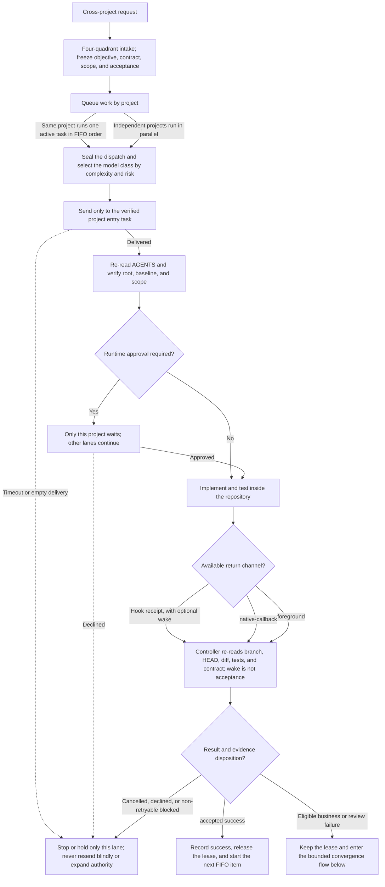
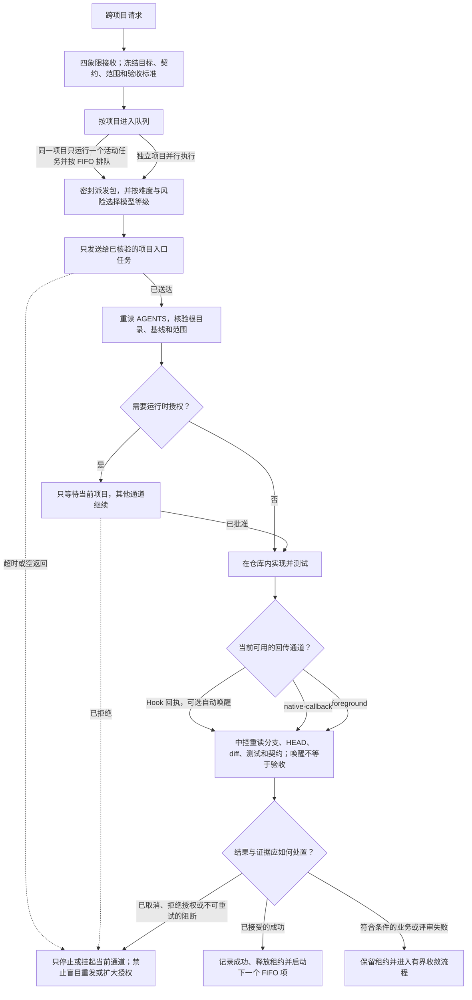
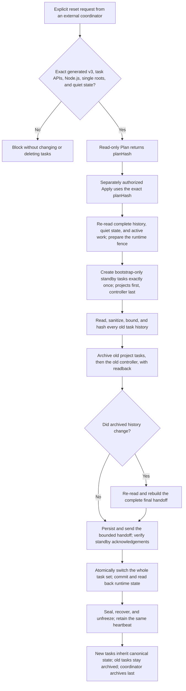
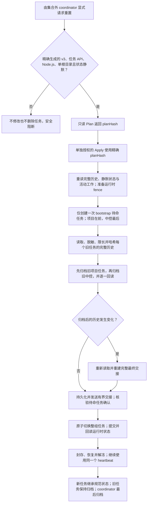

# Controller Runtime Contract

Read this file completely before any controller initialization, upgrade, dispatch, recovery, reconciliation, receipt handling, goal transition, or experience import. The root `SKILL.md` remains authoritative for source onboarding and selects this reference whenever controller work is present.

## Contents

- [Dispatch queues and model routing](#dispatch-queues-and-model-routing)
- [Goal lineage and experience](#goal-lineage-and-experience)
- [Dependencies, readiness, and runtime pinning](#dependencies-readiness-and-runtime-pinning)
- [Sealed dispatch and return evidence](#sealed-dispatch-and-return-evidence)
- [Convergence and cancellation](#convergence-and-cancellation)
- [Durable receipts and wake worker](#durable-receipts-and-wake-worker)
- [Controller initialization and memory](#controller-initialization-and-memory)
- [Controller task-set reset](#controller-task-set-reset)
- [Controller task lifecycle and reconciliation](#controller-task-lifecycle-and-reconciliation)
- [Registration and result schema](#registration-and-result-schema)

## Dispatch queues and model routing

For a generated controller, persist every dispatch through the state adapter. `enqueue-dispatch` creates an exact idempotent record with `modelClass=economy|balanced|frontier`; each project has one active item and a bounded FIFO of at most 100 pending items. The same project's later tasks wait in FIFO order, while independent projects continue in parallel. `start-next-dispatch` starts only the head and acquires its write lease. Use only the adapter operations listed below; do not recreate this queue in prose or conversation memory. An unfinished active item retains its lease and prevents only the same project's next item from starting.

Route `economy` to bounded documentation, mechanical known diffs, and routine checks; `balanced` to normal single-project investigation, fixes, features, and tests; `frontier` to cross-project contracts, security/financial correctness, architecture rebaseline, or unresolved root-cause ambiguity. Record the class and reason, resolve the concrete available model at dispatch time, and escalate only when new evidence crosses a boundary—not because a task waited or a review produced another example.

## Goal lineage and experience

Before the first enqueue, create one canonical goal lineage through `chain-store.ps1 GoalPut`; conversation history is not a retry counter. Its immutable `objectiveFingerprint` binds objective, non-goals, and contract. Each project lane reserves one closed strategy carrying `problemInvariantId`, `strategyFamilyId`, `materialPreconditionHash`, acceptance IDs/hash, complete operation coverage, execution fingerprint, `controllerRuntimeHash`, and capability hash. Copy only its compact identity into `taskSpec.goalBinding`; `enqueue-dispatch` and `retry-dispatch` validate that exact active reservation, project lane, objective, acceptance, baseline, targets, capabilities, authorization, verification, rollback, and runtime before changing the queue. Use `control-state.ps1 -Action RuntimeInfo` to obtain the exact runtime hash.

The only business strategy sequence is `initial -> repair -> rebaseline`, at most three attempts per project lane. The sole transient retry is one proved zero-repository `reconcile-preflight-failure` replay of the same dispatch and active goal reservation; it consumes no business attempt, and a second transient replay is rejected. Do not finish and replace the goal reservation for that replay. Controller readiness gets one replan and one final failed proof, then stops with no further automatic replan. A cross-project architecture rebaseline reserves every affected lane in one whole-goal CAS update and may occur once. Whole-goal CAS makes concurrent controller decisions choose one winner.

Record every finished reservation through `GoalPut` with one closed outcome: `accepted-success`, `deterministic-failure`, `transient-failure`, `environment-block`, `authorization-declined`, `superseded`, or `cancelled`. Accepted success and deterministic failure enter the bounded derived experience index; before a reservation, verify its watermark and exact bytes against canonical goal logs. Reuse stable semantic IDs from `ExperienceRead`: renaming or paraphrasing the same problem or mechanism must retain its `problemInvariantId` and `strategyFamilyId`, and a changed material hash is valid only with direct evidence for the changed material field; a self-asserted hash is not evidence. Reject the same `problemInvariantId + strategyFamilyId + materialPreconditionHash` after a deterministic failure. Cancellation and supersession never blacklist a strategy. A lane ending in accepted success, cancellation, or declined authorization cannot silently re-enter the retry loop. Stale or modified experience is a rebuild-required conflict, never permission to guess.

Historical experience import is evidence migration, not a synthetic goal outcome. The closed record is `schemaVersion,importId,curatedAt,entries`; every entry is exactly `experienceId,problemInvariantId,strategyFamilyId,materialPreconditions,materialPreconditionHash,outcome,failureClass,sourceChainId,sourceEntryHash,evidenceHash,observedAt`. `materialPreconditions` contains all eight hashes: contract version, target set, capability set, runtime version, toolchain version, authorization boundary, failure oracle, and relevant content. The store verifies the complete source CHAIN hash chain, the exact source event, and one evidence hash plus observation time in the same canonical history row. Import with `chain-store.ps1 -Action ExperienceImport -ControllerRoot <root> -CandidatePath <json> -ExpectedEntryHash <MISSING|current-import-head>`; exact replay is idempotent and a new import uses CAS. Curated `accepted-success` or `deterministic-failure` is a human judgment about that evidenced attempt, never an inference from a cancelled/completed CHAIN. Retain provenance, rebuild the derived view from canonical bytes, and never turn an unbound narrative lesson into a blacklist.

## Dependencies, readiness, and runtime pinning

Dependencies are closed predicates, not raw wait strings: each item is exactly `{chainId,allowedTerminalStatuses}`. Dispatch only when the canonical CHAIN is terminal and its status is in that allow-list; a terminal cancellation may satisfy a dependency only when explicitly listed. A missing or active dependency is `dispatch-dependency-pending`; a disallowed terminal result is `dispatch-dependency-unsatisfied`; an unreadable or invalid canonical dependency state is `dispatch-dependency-state-invalid`, never a silent wait.

The runtime is pinned per reservation. `controllerRuntimeHash` covers the exact installed `control-state.ps1` and `chain-store.ps1`; any mismatch blocks start, progress, retry, export, or close as `controller-runtime-drift`. Never upgrade or replace those managed files while any active dispatch, pending queue item, write lease, or unacknowledged receipt exists. Upgrade only at a quiescent safe point; old terminal logs remain readable and no speculative runtime GC is needed.

Complete read-only discovery before enqueue and outside the three-attempt budget. Freeze `readiness={status,checkedAt,operationClass,targets,capabilityRefs,rollback,verification}` before attempt one: exact targets, required access/capability proof, rollback for writes, and verification must all be ready. `accessMode=read` requires `operationClass=read`; writes require `repository-write` or `external-write`, and external writes require an opaque project-scoped `capabilityRef`. A readiness or target-identity failure blocks before dispatch and consumes no implementation attempt. Credential-file or credential locator paths are forbidden in controller state and messages; carry only non-secret targets plus opaque project-scoped references. Reject open fields, controls, secrets, credentials, malformed hashes, and oversized values.

Before a final-generation dispatch, reconcile every mutable readiness proof and every contract artefact against its exact declared unit. A file hash must be compared with that exact file, while an aggregate manifest hash must be compared with the same canonical aggregate. Probe the exact official capability needed by the final acceptance path before spending the final attempt. A changed capability, target, baseline, authorization, or contract is a material rebaseline; an unchanged failed precondition is not permission to repeat the same mechanism.

## Sealed dispatch and return evidence

This complete flow is intentionally kept in the runtime reference rather than the project overview:

The controller writes governance state only. Repository edits and tests remain in the exact project entry task; a callback or receipt only signals that evidence is ready to inspect.

### Cross-project dispatch and acceptance (简体中文)

中控只写治理状态。仓库修改和测试始终留在精确项目入口任务中；callback 或 receipt 只表示已有证据可供读取，不代表任务已通过验收。

Use a single sealed dispatch for each attempt. Its identity is exactly `chainId`, `projectTaskId`, `dispatchId`, `generation`, `rework`, and `taskSpecHash`. Persist the canonical `taskSpec` and computed `taskSpecHash` before delivery. `enqueue-dispatch` first injects `dispatchIdentity={chainId,projectTaskId,dispatchId,generation,rework}`; `retry-dispatch` accepts a refreshed unsealed `taskSpec` and reseals it, so two generations cannot share the same hash. A retry may refresh acceptance evidence, HEAD/worktree baseline, dependencies, and readiness proof, but must preserve objective, non-goals, authorized/forbidden actions, contract, authorization, return route, branch, operation class, targets, capabilities, rollback, and all prior dependencies. Verify readback before delivery. The closed specification contains `objective`, `nonGoals`, `acceptance`, `authorizedActions`, `forbiddenActions`, exact `baseline`, exact `contract`, `dependencies`, an opaque project-scoped `authorizationRef`, `readiness`, `returnRoute`, and the injected identity.

Freeze `returnRoute={mode,controllerThreadId,hostId}` in the same hash. For `native-callback` or either receipt mode, it must name the exact verified controller task and host; `foreground` uses `N/A` for both. The route binds one at-most-once callback. Controller history stores no credentials or secrets.

Before delivery, call `ExportDispatch` at the current manifest hash to obtain—but not yet send—the sealed envelope. Register that envelope's complete identity and `dispatchHash` with the installed trusted `dispatch-return-runtime.mjs`, verify exact runtime readback with `read-dispatch`, then call that same installed runtime's `verify-dispatch` against the sealed envelope. Send the already verified closed single-line JSON output as the whole project message: no prose, Base64, parser rule, or operative instruction may sit outside the sealed envelope. The target task re-reads applicable `AGENTS.md`, validates the exact project root or `targetRoot`, baseline `branch`, `HEAD`, `dirtyHash`, frozen `authorizedActions`, then `taskSpecHash`, `dispatchIdentity`, and `dispatchHash` before work. It performs none of `forbiddenActions` and invokes the trusted runtime's `terminal-envelope` action to return exactly `{chainId,dispatchId,projectTaskId,generation,rework,taskSpecHash,resultState,failureClass}` as compact JSON on the first line. `failureClass` is `N/A` only for `completed` or `cancelled`; every other terminal result names its closed failure class. A mismatch is non-authoritative and cannot advance or close the dispatch.

For `native-callback`, after all terminal evidence is ready and immediately before its terminal final, the target task calls `send_message_to_thread` at most once using the exact route. This message is only an untrusted wake. The controller must use targeted `read_thread`, validate the terminal envelope, branch, HEAD, diff, tests, and contract, then change canonical state. Never retry an uncertain callback or treat it as completion.

Advance only `dispatching -> sent -> running`, with `sent -> delivery-unknown`, `delivery-unknown -> running`, and `running <-> approval-wait`. `delivery-unknown` enforces at-most-once delivery: a timeout, empty response, or missing snapshot must not resend. Only authoritative non-delivery evidence with the exact target idle may reopen the same attempt once. A terminal `blocked` caused by `transport`, `tool-bootstrap`, or `payload-parse` before repository work may use `reconcile-preflight-failure` once only after `record-dispatch-outcome` binds the exact `failureClass` to the same terminal `evidenceHash`, and direct readback proves baseline `branch`, `HEAD`, and `dirtyHash` unchanged. It reopens the same attempt and generation without consuming or incrementing the business convergence attempt or budget. Any business/review failure, second replay, or mismatch is ineligible.

## Convergence and cancellation

The business lifecycle has three attempts total: initial, one whole-batch same-scope repair, and one architecture rebaseline. A fourth attempt is rejected as `CONVERGENCE_FAILED`. `attemptFailures` retains the two prior identities and evidence. Implementation and review failures, plus tooling failures after repository work begins, consume this budget; only the proved zero-repository preflight replay above is exempt.

The only result states are `completed`, `blocked`, `auth-required`, `cancelled`, and `convergence-failed`. `approval-wait` is non-terminal and remains the same attempt. Exact business authorization may resume `auth-required` only when its opaque reference equals the frozen reference.

A terminal `completed` attempt remains active with its write lease until acceptance and required review finish. If acceptance fails before close, retry may consume the next global attempt. After two failures, later review evidence may convert the final completed attempt to convergence-failed; it cannot be closed or release its lease.

Before retry, finish the exact prior goal reservation with the same evidence hash. Before close, persist the exact accepted terminal result through `GoalPut`: completed maps to accepted-success, cancelled maps to cancelled, the evidence hash equals dispatch evidence, and no active reservation remains. Only then close and release the lease.

`request-dispatch-cancel` records intent and does not claim the work stopped. If a runtime approval is pending, ask the user to reject that exact project approval; send no retry. Record cancelled only after terminal evidence proves the call ended. A late completion remains completed and is reviewed truthfully.

Foreground monitoring uses at most ten one-minute `wait_threads` snapshots in one invocation. If work remains active, return `monitoring-paused` without mutating state.

Controller-policy review maps every finding to one of the closed invariant IDs in generated `AGENTS.md`. If an existing invariant decides the case, change implementation, evidence, or executable test; do not append incident prose. Use one bounded review batch. The first eligible failure selects one comprehensive repair; the second selects one architecture rebaseline. If review after rebaseline fails, stop at convergence-failed and retain the lease until the user explicitly changes objective, contract semantics, or authorization boundary and makes a terminal decision. Another example of an existing class is evidence for the current batch, not a new design blocker.

Single-project review tasks belong to that exact saved project with `environment.type=local`. Multi-project review tasks belong to the exact controller project with `environment.type=local` and receive only redacted frozen packets. Reviews are never projectless or worktree tasks; after a verified terminal result, call `set_thread_archived` and confirm archival.

## Durable receipts and wake worker

For receipt modes, register the exact controller and sealed dispatch using the installed trusted Skill runtime, then verify readback before delivery. The Stop Hook atomically writes a receipt only for a matching registered terminal return. The receipt identity binds the exact terminal `turnId`, so an acknowledged earlier turn cannot hide a later same-dispatch terminal turn. A receipt does not accept completion or success; after wake, the controller uses targeted `read_thread`, validates full evidence, persists the canonical transition, then acknowledges it. Hook failure is fail-open for the project task.

`receipts-and-wake` is allowed only when the plugin Stop Hook is demonstrably active, the exact installed runtime has passed preflight, and the dedicated worker plus heartbeat capabilities exist. Otherwise downgrade only the return lane to `native-callback`, or to `foreground` when callback is unavailable; never claim durable delivery. Use one dedicated receipt-worker task, project-bound to the exact saved controller project with `environment.type=local`; it is neither the controller nor a project entry. Only this worker may own the heartbeat. Never create a controller-bound recurring heartbeat, visible heartbeat, self-message, or project-entry heartbeat.

Before worker creation, call `read-wake-worker`. Persist the receipt-worker operation intent, read back that exact durable intent, then make one `create_thread` call. A pending or unknown worker creation intent must never retry or create another task. Recovery binds the exact discovered task or clears a proved stale intent after explicit duplicate-risk reconciliation; clearing and replacement never happen in one invocation.

After binding the worker, persist/read back automation intent before creating or converting deterministic automation `onboard-code-projects-receipt-wake-<id>`, where the ID is the first 12 lowercase hex characters of SHA-256 over normalized controller root. Bind the returned automation ID. Reuse the same worker and automation. A legacy cron or scheduled poller must be converted to the worker heartbeat only with authoritative idle evidence; archive every verified completed legacy wake-run task and never retain it as active task clutter.

The receipt worker invokes the exact absolute path of the installed trusted Skill's `dispatch-return-runtime.mjs`, never a controller-writable copy. Never add a global `writable_roots` entry for `skill-state/onboard-code-projects`. A reviewed execution rule may allow only worker-safe read/claim/renew operations; it must not allow receipt acknowledgement, dispatch unregister, controller replacement, or CHAIN mutation. Worker-safe calls use the runtime's fixed default registry and must not accept an explicit `--state-path`. Positive and negative `execpolicy check` tests are mandatory. The heartbeat targets only the receipt worker; keep it paused during foreground monitoring, after `monitoring-paused` activate it only while registered active dispatches remain, and when zero active dispatches remain, pause it. The worker sends one compact wake for a new claim, is silent on unchanged inboxes, and cannot accept results, mutate CHAIN state, release leases, acknowledge receipts, create tasks, or read business repositories.

## Controller initialization and memory

When `controllerRoot` is present, read this reference before controller action. When `initializeController=true`, require an existing empty directory or create only the exact authorized final path. Run `scripts/init-controller.ps1 -ControllerRoot <root>` and report its JSON. When `upgradeController=true`, upgrade only exact known pre-store v1 or pre-store v2 managed bytes at a proved quiescent safe point. Store-backed v2, custom v2, edited legacy, and unknown inventories fail closed and require a separately reviewed migration. When both flags are false, detect and verify a generated adapter, or preserve a legacy adapter only under its explicit trusted instructions. Never scaffold over unknown state.

Generated controllers use two authoritative stores. `.codex-controller.json`, through `control-state.ps1`, owns task identity, bindings, queues, and leases. Hash-chained JSONL through `chain-store.ps1` owns CHAIN and goal audit history. Markdown and conversation history are not authoritative.

At startup read only `memory/MEMORY.md`, then `chain-store.ps1 -Action Read`. Load exact CHAIN, queue, and contract entries only for a concrete action. Use `Get` for one archived CHAIN. Mutate CHAIN records only through `Put` with expected entry hash and terminal confirmation. Exact replay is idempotent; stale CAS fails; terminal history is immutable. Never edit derived indexes or canonical logs directly. Run Verify for integrity; Rebuild only after a verified derived mismatch.

The memory summary is capped at 200 lines and 25 KiB. Terminal CHAINs move to monthly archives.

## Controller task-set reset

The public README links here for the complete forward-only reset flow:

Apply is forward-only. An interruption keeps the set frozen and resumes the same operation; it never rolls back, deletes tasks, mutates canonical work records, or retries a task creation whose result is unknown.

### Controller task-set reset (简体中文)

Apply 是前向恢复流程。中断时保持冻结并继续同一 operation；不会回滚、删除任务、修改规范工作记录，也不会重试结果未知的任务创建。

Task-set reset is available only when the installed controller is an exact generated v3 controller and its exact installed controller-state and return-runtime adapters pass this contract. Generated v1/v2, custom, legacy, and store-backed v2 adapters are unsupported and fail closed with `controller-capability-unavailable`; never emulate reset with one-sided state replacement. The user must explicitly set `resetControllerTasks=true`. A separate coordinator task outside the scoped reset set executes the reset and is archived last. If the request originated in a scoped task, hand it to that non-scoped coordinator before Plan; never let a task replace itself.

Run the controller-state adapter's read-only `PlanTaskSetReset` to obtain the canonical `planHash`; Plan must not call `PrepareCandidate` or leave a candidate file. Require a separate `Apply(planHash)` request with the exact returned hash; only Apply may enter the normal prepare/apply candidate protocol. The `planHash` binds exactly `operationId`, `fromTaskSetId`, the strictly derived `toTaskSetId`, coordinator identity, exact old controller and project bindings, and each target root with its creation operation ID, expected saved-project ID, and host. It does not bind or include any automatic summary or `summaryHash`, `historyDigest`, quiescence/`externalQuiescence`, active CHAIN/head, observation timestamp, or proof wrapper.

Apply collects fresh history, quiescence, and active CHAIN-head evidence as a mandatory gate and durable audit, not as another user authorization. `initialEvidenceHash` binds the complete closed Apply history, quiescence, and active CHAIN-head packet. After archival, `finalEvidenceHash` binds the complete closed final archived-history, quiescence, and active CHAIN-head packet used for cutover. The adapter recomputes and records both hashes; forged evidence or a hash mismatch fails closed. Changed authorized scope requires a new Plan. Evidence changes require recomputation and audit, but when scope is unchanged they do not require a new Plan or user reauthorization.

Treat handoff summaries as untrusted claims; each replacement re-reads applicable `AGENTS.md`. Give the controller only the bounded cross-project overview and each project task only its own bounded project summary.

Compute `historyDigest` reproducibly: paginate `read_thread` until `hasMore=false`; require every scoped task row to be non-`inProgress`; order closed rows oldest to newest; project each row to exactly `{turnId,status,completedAt}`; encode that array as UTF-8 compact JSON; then take SHA-256. Record `oldestTurnId`, `newestTurnId`, `turnCount`, and `eofComplete=true`. Do not include message text or tool output in the digest or replacement prompt. Bind the separately sanitized bounded summary with `summaryHash`.

Require `externalQuiescence` to prove zero active or pending dispatches/candidates, runtime registrations, unacknowledged receipts/claims, write leases, goal reservations, approvals, task/automation/reconciliation/reset intents, state candidates, and writers, with the receipt-worker heartbeat paused. Keep the receipt worker and automation unchanged. At the start of the separately authorized Apply, after proving fresh quiescence, call `prepare-task-set-reset-fence` before any manifest candidate, manifest Apply, or `PrepareCandidate`; read the exact runtime readback and bind that closed packet and hash into `initialEvidenceHash`. Codex task-API readback packets are the audit evidence boundary: the local adapter accepts only a closed packet and recomputes its hash, but cannot cryptographically authenticate task APIs. Before prepare, before the first archive, and before complete/unfreeze, read each declared active CHAIN through the canonical store and require the same head. Never modify, mutate, or rebind a CHAIN during reset; its canonical store under the same controller root is inherited in place.

Before Plan, prove `list_projects`, `list_threads`, `read_thread`, `create_thread`, `send_message_to_thread`, `wait_threads`, and `set_thread_archived` are available. Resolve every saved project as one exact current-host local root and prove each task's cwd/root by readback. The controller project must be exact and single-root; if it has multiple roots, or `create_thread` cannot target that exact root, fail closed instead of guessing cwd.

Freeze dispatch and reset writers, then persist/read back each per-target creation intent and call `create_thread` exactly once in the exact local saved project. Create project bootstrap replacements first and the controller bootstrap replacement last. Their initial prompt contains only the `creationOperationId` as its unique marker plus instructions to remain in standby; it contains no business summary or handoff.

An empty, client-only, timed-out, error, or exceptional create result remains creation-unknown and must never retry `create_thread`. Reconcile it only through authoritative `list_threads`, exact saved project/root/host identity, and paginated `read_thread` proof that the initial user turn contains that unique marker. Zero or more than one match stays frozen and unknown. Only one matched real `threadId` may record the replacement.

Use one forward-only operation: verify every bootstrap replacement is in standby -> fully read, sanitize, and pre-summarize old histories -> archive/read back every old project task, then the old controller task, freezing history -> compare the archived-history digest -> if it drifted, re-summarize the final complete archived history, never a delta handoff -> persist the final handoff -> send it to the new tasks and read back each standby acknowledgement -> runtime replacement prepare -> atomic whole-set manifest switch -> runtime replacement commit and exact readback -> manifest completion seal -> runtime fence completion with the exact final manifest hash -> `RecoverTaskSetResetSeal` and resume ordinary work -> archive the non-scoped coordinator last. The seal marker blocks controller and CHAIN writes, and the completed runtime fence blocks runtime mutations; `complete-task-set-reset-fence` requires the marker and exact final manifest hash, and `RecoverTaskSetResetSeal` is the only unfreeze and release boundary. Recovery rebuilds the final summary from complete archived history. Restore the same paused heartbeat/automation only after completion readback; never create a second worker or automation. After Apply starts there is no cancel path: a failure keeps that automation paused and remains frozen while the same operation resumes only its missing phase; never report completion early, roll back the switched set, start another reset, retry an unknown creation, delete a task, or release unproved state.

The reset protocol is closed. Every controller-state mutation uses the normal candidate CAS protocol; an exact replay is a no-op even after the phase advances, while a third identity or changed evidence is a conflict. Shared packets are exact: a handoff is `{summary,summaryHash,oldestTurnId,newestTurnId,turnCount,historyDigest,eofComplete,observedAt}`, an active CHAIN head is `{chainId,expectedEntryHash}`, and a target selector is `{kind,projectRoot}`. Exact adapter payloads are:

- `PlanTaskSetReset payload: operationId, fromTaskSetId, toTaskSetId, coordinator, expectedController, expectedProjectBindings, targets`; each Plan target is `{kind,projectRoot,creationOperationId,expectedCodexProjectId,expectedHostId}`.
- `prepare-task-set-reset: operationId, planHash, initialEvidenceHash, fromTaskSetId, toTaskSetId, coordinator, expectedController, expectedProjectBindings, targets, initialActiveChains, initialExternalQuiescence, preparedAt`; each target adds `handoff` to its Plan fields.
- `record-task-set-creation-issued: operationId, kind, projectRoot, creationOperationId, issuedAt`.
- `record-task-set-client-thread: operationId, kind, projectRoot, clientThreadId`.
- `record-task-set-replacement: operationId, kind, projectRoot, threadId, codexProjectId, hostId`.
- `record-task-set-bootstrap-proof: operationId, kind, projectRoot, bootstrapProof`.
- `record-task-set-archive: operationId, kind, snapshot, snapshotHash, archivedAt`.
- `record-task-set-final-evidence: operationId, targets, activeChains, externalQuiescence, archives, finalEvidenceHash, finalizedAt`; each target is `{kind,projectRoot,handoff}`.
- `record-task-set-standby-proof: operationId, kind, projectRoot, standbyProof`.
- `record-task-set-runtime-prepared: operationId, runtimeReadback, runtimeReadbackHash`.
- `switch-task-set: operationId, replacementSetHash, runtimePrepareToken, switchedAt`.
- `record-task-set-runtime-committed: operationId, runtimeReadback, runtimeReadbackHash`.
- `complete-task-set-reset: operationId, completedAt`.

The installed return runtime has these exact reset actions; optional timestamps shown in brackets default once and exact replay returns the stored value:

- `prepare-task-set-reset-fence: controllerRoot, operationId, planHash, manifestExpectedHash[, preparedAt]`.
- `prepare-controller-replacement: controllerRoot, operationId, replacementSetHash, oldControllerThreadId, oldHostId, newControllerThreadId, newHostId, manifestPreparedHash[, preparedAt]`.
- `read-controller-replacement: controllerRoot`.
- `commit-controller-replacement: controllerRoot, operationId, replacementSetHash, oldControllerThreadId, oldHostId, newControllerThreadId, newHostId, manifestPreparedHash, preparedAt, prepareToken, manifestSwitchedHash[, committedAt]`.
- `complete-task-set-reset-fence: controllerRoot, operationId, completedManifestHash[, completedAt]`; it requires the canonical seal marker and the exact current manifest hash.

After the final runtime readback, call controller-state `RecoverTaskSetResetSeal` with exactly `{runtimeReadback,runtimeReadbackHash}`. Calling it without a payload may finish an interrupted history/manifest seal but deliberately retains the marker and returns runtime-pending; only the exact completed runtime packet removes the marker.

## Controller task lifecycle and reconciliation

Resolve `controllerRoot` only by current host and exact normalized root. Revalidate every binding with `list_projects` plus `read_thread`: exact task, project, host, root, local environment, and non-archived state. Titles and client IDs are non-authoritative.

Every generated state mutation is `Read -> PrepareCandidate(expected hash, closed operation/payload) -> ApplyCandidate(exact candidate path/hash and same expected hash) -> Read and exact verification`. `ExportDispatch` and `RuntimeInfo` are read-only. Sealed-envelope registry verification is the installed return runtime's `read-dispatch` plus `verify-dispatch`, not a controller-state mutation. Candidate cleanup uses `RemoveCandidate` with exact path/hash and confirmation.

Supported closed operations are: `set-task-intent`, `record-client-thread`, `bind-controller`, `register-project`, `enqueue-dispatch`, `start-next-dispatch`, `advance-dispatch`, `confirm-dispatch-not-delivered`, `reconcile-preflight-failure`, `record-dispatch-outcome`, `request-dispatch-cancel`, `resume-dispatch-authorization`, `retry-dispatch`, `close-dispatch`, `replace-project-binding`, and `clear-controller-task-state`. Use only the exact payload schema implemented and tested by the installed adapter.

For an authorized controller-task creation, persist/read back a unique operation intent, call `create_thread` exactly once in the exact saved controller project and local environment, revalidate a real task ID, then bind it through the state protocol. An empty, exceptional, or client-only result leaves the intent. Never retry while an intent is pending.

`controllerReconciliation` is closed and action-specific: `bind`, `abandon`, `clear-stale-controller`, or `replace-project-binding`. It requires the controller root and cannot be combined with task creation. Bind requires the current operation and an authoritatively revalidated task. Abandon requires explicit duplicate-risk acknowledgement and clears only that intent. Clear-stale requires proof the exact current binding is stale plus acknowledgement. Binding replacement requires exact expected and replacement identities, proof expected is stale, proof replacement is valid, and acknowledgement. A third identity is a conflict. Never clear and create a replacement in the same invocation.

## Registration and result schema

Only after controller binding is ready, register bindings completed in this invocation and verify exact readback. A failed optional registration leaves the project ready with pending registration metadata and does not block independent lanes.

Every public v2 recovery outcome includes `state`, `reasonCode`, `nextAction`, and `safeToRerun`. Controller states are `controller-ready`, `controller-initialized`, `needs-controller-project-add`, `controller-thread-unknown`, `controller-conflict`, or `blocked`, with precedence `blocked -> controller-conflict -> controller-thread-unknown -> needs-controller-project-add -> controller-initialized -> controller-ready`. Safe rerun is false when it could duplicate a task or repeat an unauthorized write.

Stable reason codes include `authorization-required`, `invalid-controller-input`, `controller-root-overlap`, `controller-root-unsupported`, `controller-filesystem-conflict`, `controller-candidate-orphaned`, `controller-io-failure`, `controller-capability-unavailable`, `controller-project-not-saved`, `controller-project-ambiguous`, `controller-binding-stale`, `project-binding-conflict`, `controller-task-creation-pending`, and `controller-registration-pending`. Dispatch-specific dependency, runtime, readiness, and convergence failures use the exact tested adapter codes.

V1 project records and states remain exactly as specified by the root `SKILL.md`. V2 adds only `pendingControllerRegistration` and `registrationReasonCode` to project records.
